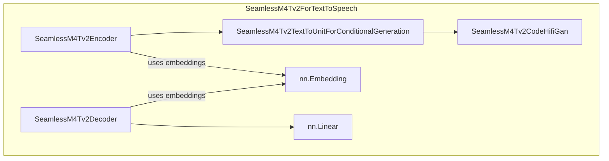

# part_6
This module implements the SeamlessM4Tv2 model for text-to-speech generation. It converts input text into spoken audio using an encoder-decoder architecture, a text-to-unit model, and a vocoder.

<!-- DIAGRAM_JSON
{
    "direction": "TD",
    "nodes": [
        {
            "id": "part_6",
            "label": "Part 6",
            "type": "module"
        },
        {
            "id": "c0",
            "label": "Sam3TrackerVideoModel",
            "type": "component"
        },
        {
            "id": "c1",
            "label": "XCLIPModel",
            "type": "component"
        }
    ],
    "edges": [
        {
            "source": "part_6",
            "target": "c0"
        },
        {
            "source": "part_6",
            "target": "c1"
        }
    ],
    "groups": [],
    "_auto_generated": true
}
-->
