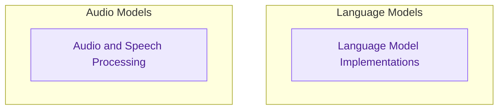
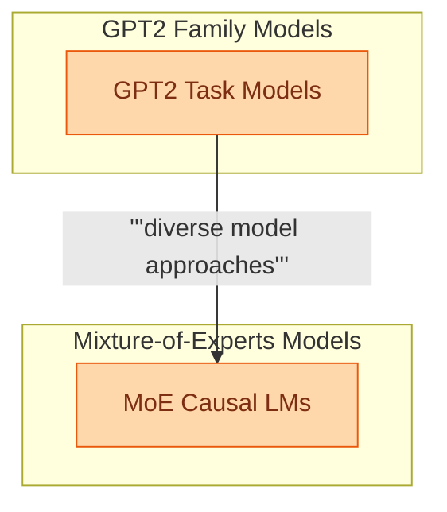

# Advanced Language and Audio Models

This module integrates advanced models for natural language processing and audio tasks. It features GPT-2 variants and Mixture-of-Experts (MoE) language models, alongside specialized audio models for text-to-text translation and speech pre-training.

<!-- DIAGRAM_JSON
{
    "direction": "TD",
    "nodes": [
        {
            "id": "language_model_implementations",
            "label": "Language Model Implementations",
            "type": "module",
            "link": "language_model_implementations.md"
        },
        {
            "id": "audio_and_speech_processing",
            "label": "Audio and Speech Processing",
            "type": "module",
            "link": "audio_and_speech_processing.md"
        }
    ],
    "edges": [],
    "groups": [
        {
            "id": "language_models_group",
            "label": "Language Models",
            "role": "analytical",
            "nodes": [
                "language_model_implementations"
            ]
        },
        {
            "id": "audio_models_group",
            "label": "Audio Models",
            "role": "analytical",
            "nodes": [
                "audio_and_speech_processing"
            ]
        }
    ]
}
-->

This module provides various language model implementations, including specialized GPT2 models for tasks like question answering and token classification, and several Mixture-of-Experts (MoE) causal language models.

<!-- DIAGRAM_JSON
{
    "direction": "TD",
    "nodes": [
        {"id": "gpt2_models", "label": "GPT2 Task Models", "type": "module", "link": "gpt2_models.md"},
        {"id": "moe_causal_lm", "label": "MoE Causal LMs", "type": "module", "link": "moe_causal_lm.md"}
    ],
    "edges": [
        {"source": "gpt2_models", "target": "moe_causal_lm", "label": "diverse model approaches"}
    ],
    "groups": [
        {"id": "gpt2_group", "label": "GPT2 Family Models", "role": "generative", "nodes": ["gpt2_models"]},
        {"id": "moe_group", "label": "Mixture-of-Experts Models", "role": "generative", "nodes": ["moe_causal_lm"]}
    ]
}
-->

