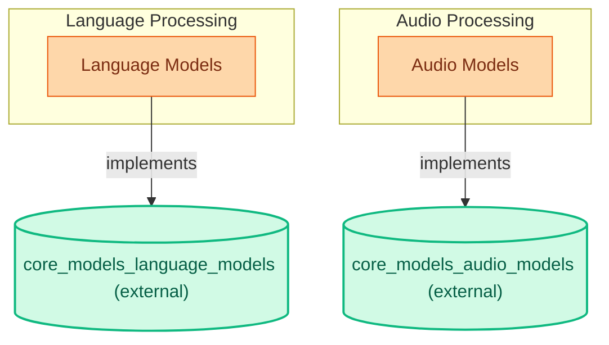

# Model Implementations for Language and Audio Tasks
This module integrates diverse model architectures for language processing, including causal and conditional generation, alongside specialized audio models for sequence classification and pre-training, facilitating various NLP and audio-related applications.
<!-- DIAGRAM_JSON
{
    "direction": "TD",
    "nodes": [
        {
            "id": "part_8",
            "label": "Part 8",
            "type": "module"
        },
        {
            "id": "c0",
            "label": "UniSpeechForSequenceClassifica",
            "type": "component"
        },
        {
            "id": "c1",
            "label": "UniSpeechSatForPreTraining",
            "type": "component"
        },
        {
            "id": "c2",
            "label": "UniSpeechSatForXVector",
            "type": "component"
        },
        {
            "id": "c3",
            "label": "UniSpeechSatForCTC",
            "type": "component"
        },
        {
            "id": "c4",
            "label": "UniSpeechSatForSequenceClassif",
            "type": "component"
        }
    ],
    "edges": [
        {
            "source": "part_8",
            "target": "c0"
        },
        {
            "source": "part_8",
            "target": "c1"
        },
        {
            "source": "part_8",
            "target": "c2"
        },
        {
            "source": "part_8",
            "target": "c3"
        },
        {
            "source": "part_8",
            "target": "c4"
        }
    ],
    "groups": [],
    "_auto_generated": true
}
-->
