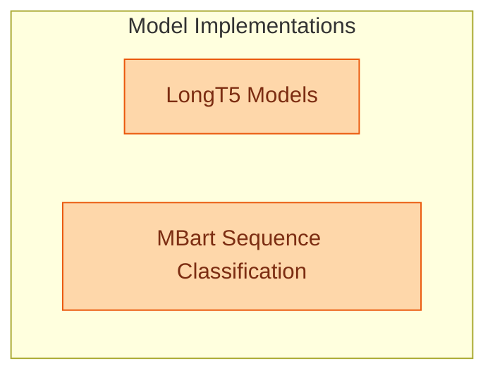

# Language Model Implementations (Part 9)
This module provides implementations for LongT5 models, including the base, encoder-only, and conditional generation versions, alongside the MBart model specifically configured for sequence classification tasks.

<!-- DIAGRAM_JSON
{
    "direction": "TD",
    "nodes": [
        {"id": "longt5_models", "label": "LongT5 Models", "type": "module", "link": "longt5_models.md"},
        {"id": "mbart_classification", "label": "MBart Sequence Classification", "type": "module", "link": "mbart_classification.md"}
    ],
    "edges": [],
    "groups": [
        {"id": "model_implementations", "label": "Model Implementations", "role": "generative", "nodes": ["longt5_models", "mbart_classification"]}
    ]
}
-->
