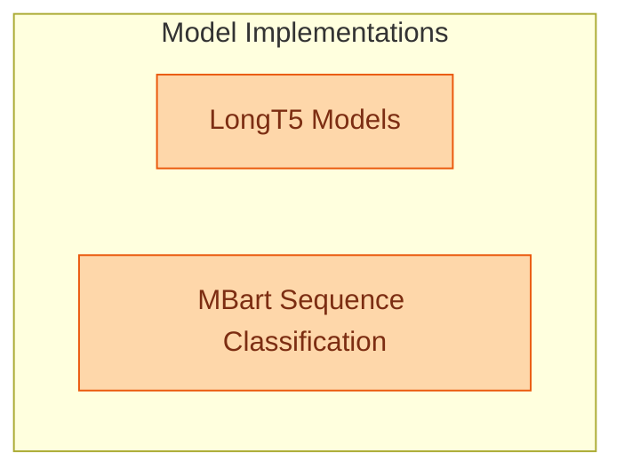

# Language Model Implementations (Part 9)
This module provides implementations for LongT5 models, including the base, encoder-only, and conditional generation versions, alongside the MBart model specifically configured for sequence classification tasks.

<!-- DIAGRAM_JSON
{
    "direction": "TD",
    "nodes": [
        {
            "id": "part_9",
            "label": "Part 9",
            "type": "module"
        },
        {
            "id": "c0",
            "label": "UniSpeechSatForAudioFrameClass",
            "type": "component"
        },
        {
            "id": "c1",
            "label": "Wav2Vec2ForXVector",
            "type": "component"
        },
        {
            "id": "c2",
            "label": "Wav2Vec2ForAudioFrameClassific",
            "type": "component"
        },
        {
            "id": "c3",
            "label": "Wav2Vec2BertForXVector",
            "type": "component"
        }
    ],
    "edges": [
        {
            "source": "part_9",
            "target": "c0"
        },
        {
            "source": "part_9",
            "target": "c1"
        },
        {
            "source": "part_9",
            "target": "c2"
        },
        {
            "source": "part_9",
            "target": "c3"
        }
    ],
    "groups": [],
    "_auto_generated": true
}
-->
