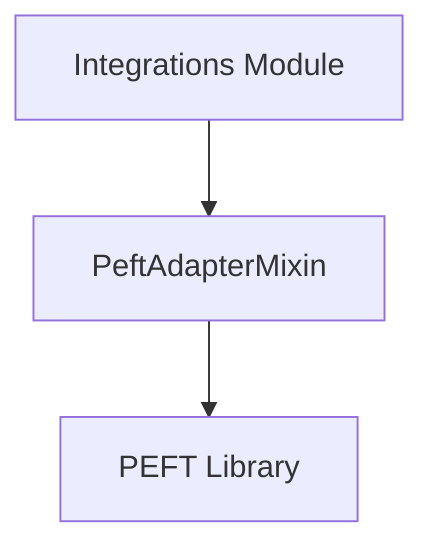

# `peft_integration` Module Documentation

## Introduction

The `peft_integration` module provides a comprehensive set of functionalities to seamlessly integrate Parameter-Efficient Fine-Tuning (PEFT) methods into 🤗 Transformers models. It focuses on non-prompt learning PEFT methods, such as LoRA and IA³, allowing developers to load, manage, and utilize adapters for efficient model fine-tuning and inference.

## Purpose and Core Functionality

This module's primary purpose is to extend the capabilities of `transformers` models by incorporating PEFT adapters. It enables users to drastically reduce the computational and memory costs associated with fine-tuning large language models, making advanced model customization more accessible. The core functionality is encapsulated within the `PeftAdapterMixin` class, which offers the following key features:

### `PeftAdapterMixin`

-   **Loading Adapters (`load_adapter`)**: Allows loading pre-trained PEFT adapters from the Hugging Face Hub or local paths. It supports various configurations and offers options for memory optimization (`low_cpu_mem_usage`) and hotswapping adapters.
-   **Enabling Hotswapping (`enable_peft_hotswap`)**: Provides a mechanism to prepare the model for efficient hotswapping of LoRA adapters, which can be beneficial for compiled models or when dynamically changing adapter ranks without recompilation.
-   **Adding New Adapters (`add_adapter`)**: Facilitates the attachment of new PEFT adapters to the model for training purposes, allowing users to experiment with different PEFT configurations.
-   **Setting Active Adapters (`set_adapter`)**: Manages which adapter (or set of adapters) is currently active for inference or further training, providing flexibility in multi-adapter scenarios.
-   **Disabling/Enabling Adapters (`disable_adapters`, `enable_adapters`)**: Offers control over activating or deactivating all loaded adapters, allowing users to switch between base model inference and adapter-enhanced inference.
-   **Retrieving Active Adapters (`active_adapters`)**: Returns a list of currently active adapters, useful for monitoring and managing multi-adapter setups.
-   **Getting Adapter State Dictionary (`get_adapter_state_dict`)**: Extracts the state dictionary containing only the weights of a specified or active adapter, essential for saving and sharing adapter weights.
-   **Accelerate Integration (`_dispatch_accelerate_model`)**: Provides an internal method for re-dispatching models loaded with Hugging Face Accelerate, ensuring proper device mapping when adapters are used.
-   **Deleting Adapters (`delete_adapter`)**: Allows for the removal of specific PEFT adapters from the model, enabling dynamic management of loaded adapters.

## Architecture and Component Relationships

The `peft_integration` module is built around the `PeftAdapterMixin` class. This mixin is designed to be inherited by `transformers` model classes, injecting PEFT capabilities directly into them. It primarily interacts with the external `peft` library to perform adapter-related operations such as injecting adapters into the model, managing their configurations, and handling their state dictionaries.

<!-- DIAGRAM_JSON
{
    "direction": "TD",
    "nodes": [
        {"id": "peft_adapter_mixin", "label": "PeftAdapterMixin", "type": "component", "link": null},
        {"id": "peft_library", "label": "PEFT Library", "type": "external", "link": null},
        {"id": "integrations", "label": "Integrations Module", "type": "external", "link": "integrations.md"}
    ],
    "edges": [
        {"source": "peft_adapter_mixin", "target": "peft_library"},
        {"source": "integrations", "target": "peft_adapter_mixin"}
    ],
    "groups": []
}
-->

## How it Fits into the Overall System

The `peft_integration` module is a sub-module of the larger [integrations](integrations.md) module within the `transformers` library. It provides a crucial bridge between the `transformers` ecosystem and the `PEFT` library, allowing `transformers` models to leverage the benefits of parameter-efficient fine-tuning without requiring significant modifications to the core model architecture. By providing a standardized interface for loading and managing PEFT adapters, it contributes to the modularity and extensibility of the `transformers` library, enabling advanced research and application of efficient deep learning techniques.
