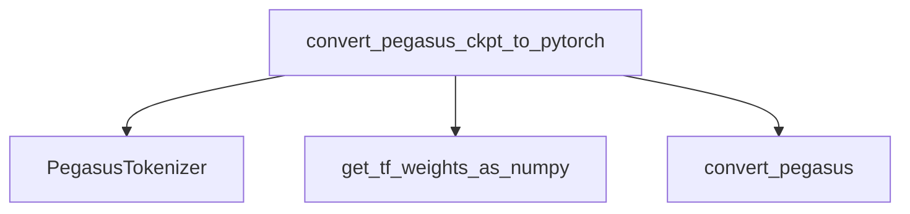

# Pegasus Models Documentation

### Module Purpose

The `pegasus_models` module primarily facilitates the conversion of pre-trained Pegasus models from TensorFlow checkpoints to the PyTorch framework. This is crucial for enabling interoperability and leveraging Pegasus models within PyTorch-based environments.

### Architecture and Component Relationships

The core of this module is the `convert_pegasus_ckpt_to_pytorch` function, which orchestrates the entire conversion process. It relies on internal utility functions for obtaining TensorFlow weights and performing the actual model conversion. It also interacts with the `tokenization_utilities` module for handling tokenizer-related operations.

<!-- DIAGRAM_JSON
{
    "direction": "TD",
    "nodes": [
        {"id": "convert_pegasus_ckpt_to_pytorch", "label": "convert_pegasus_ckpt_to_pytorch", "type": "component", "link": null},
        {"id": "pegasus_tokenizer", "label": "PegasusTokenizer", "type": "external", "link": "tokenization_utilities.md"},
        {"id": "get_tf_weights_as_numpy", "label": "get_tf_weights_as_numpy", "type": "component", "link": null},
        {"id": "convert_pegasus", "label": "convert_pegasus", "type": "component", "link": null}
    ],
    "edges": [
        {"source": "convert_pegasus_ckpt_to_pytorch", "target": "pegasus_tokenizer"},
        {"source": "convert_pegasus_ckpt_to_pytorch", "target": "get_tf_weights_as_numpy"},
        {"source": "convert_pegasus_ckpt_to_pytorch", "target": "convert_pegasus"}
    ],
    "groups": []
}
-->

### Core Functionality

#### `convert_pegasus_ckpt_to_pytorch(ckpt_path: str, save_dir: str)`

This function is responsible for converting a Pegasus TensorFlow checkpoint to a PyTorch model and tokenizer.

**Parameters:**

*   `ckpt_path` (`str`): The path to the TensorFlow checkpoint file.
*   `save_dir` (`str`): The directory where the converted PyTorch model and tokenizer will be saved.

**Functionality:**

1.  **Tokenizer Saving:**
    *   It first extracts the dataset name from the `ckpt_path`.
    *   It determines the `desired_max_model_length` from `task_specific_params` based on the dataset.
    *   It initializes a `PegasusTokenizer` (from `tokenization_utilities`) with a pre-trained model and the determined `model_max_length`.
    *   The tokenizer is then saved to the specified `save_dir`.
2.  **Model Conversion:**
    *   It loads the TensorFlow weights as NumPy arrays using `get_tf_weights_as_numpy`.
    *   It retrieves configuration updates from `task_specific_params` for the specific dataset.
    *   If the dataset is "large", it further updates `cfg_updates` with all `task_specific_params`.
    *   The `convert_pegasus` function is called to perform the actual conversion of TensorFlow weights to a PyTorch model.
    *   The converted PyTorch model is then saved to `save_dir`.
    *   Finally, specific positional embedding weights (`model.decoder.embed_positions.weight` and `model.encoder.embed_positions.weight`) are removed from the state dictionary, and the modified state dictionary is saved as `pytorch_model.bin`.

This ensures that a complete and functional PyTorch Pegasus model, along with its tokenizer, is generated from a given TensorFlow checkpoint.

### How the module fits into the overall system

The `pegasus_models` module acts as a bridge between TensorFlow-trained Pegasus models and the PyTorch ecosystem. It enables users to migrate existing TensorFlow checkpoints, making these powerful models accessible for fine-tuning, inference, and integration within PyTorch-based applications. It relies on the [tokenization_utilities](tokenization_utilities.md) for handling text processing components, ensuring consistent tokenization during the conversion process.
