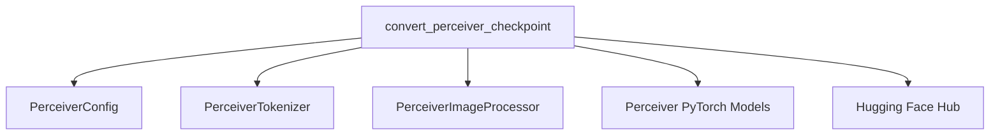

# perceiver_models

The `perceiver_models` module is responsible for providing utilities to convert Perceiver model checkpoints from their original Haiku (JAX) format to PyTorch, enabling their use within the Hugging Face Transformers ecosystem. It supports various Perceiver architectures, including masked language modeling, image classification (with different input processing methods), optical flow, and multimodal autoencoding.

## Architecture

The core functionality of the `perceiver_models` module revolves around the `convert_perceiver_checkpoint` function, which orchestrates the entire conversion process. It interacts with several external components for model configuration, tokenization, image processing, and ultimately, the Hugging Face PyTorch model implementations.

<!-- DIAGRAM_JSON
{
    "direction": "TD",
    "nodes": [
        {"id": "convert_perceiver_checkpoint", "label": "convert_perceiver_checkpoint", "type": "component", "link": null},
        {"id": "perceiver_config", "label": "PerceiverConfig", "type": "external", "link": "perceiver_config.md"},
        {"id": "perceiver_tokenizer", "label": "PerceiverTokenizer", "type": "external", "link": "perceiver_tokenizer.md"},
        {"id": "perceiver_image_processor", "label": "PerceiverImageProcessor", "type": "external", "link": "perceiver_image_processor.md"},
        {"id": "perceiver_pytorch_models", "label": "Perceiver PyTorch Models", "type": "external", "link": "perceiver_pytorch_models.md"},
        {"id": "huggingface_hub", "label": "Hugging Face Hub", "type": "external", "link": "huggingface_hub.md"}
    ],
    "edges": [
        {"source": "convert_perceiver_checkpoint", "target": "perceiver_config"},
        {"source": "convert_perceiver_checkpoint", "target": "perceiver_tokenizer"},
        {"source": "convert_perceiver_checkpoint", "target": "perceiver_image_processor"},
        {"source": "convert_perceiver_checkpoint", "target": "perceiver_pytorch_models"},
        {"source": "convert_perceiver_checkpoint", "target": "huggingface_hub"}
    ],
    "groups": []
}
-->

## Core Components

### `convert_perceiver_checkpoint`

-   **File:** `src/transformers/models/perceiver/convert_perceiver_haiku_to_pytorch.py`
-   **Purpose:** This function serves as the central utility for migrating Perceiver model weights from Haiku (JAX) checkpoints to their equivalent PyTorch implementations. It handles the parsing of Haiku's `FlatMapping` data structure, remapping of parameter keys to Hugging Face conventions, and instantiating the correct PyTorch model based on the specified architecture.
-   **Functionality:**
    1.  **Checkpoint Loading:** Loads the Haiku checkpoint using `pickle.loads`. A security check (`TRUST_REMOTE_CODE` environment variable) is in place due to the inherent risks of deserializing pickle files.
    2.  **State Extraction:** Extracts model parameters (`params`) and, if present, batch normalization states (`state`) from the loaded checkpoint.
    3.  **Haiku to PyTorch Key Mapping:** Transforms the Haiku `FlatMapping` into a flat dictionary, which is then renamed to align with Hugging Face's PyTorch model parameter naming conventions.
    4.  **Model Instantiation:** Dynamically instantiates the appropriate Hugging Face `Perceiver` model class (e.g., `PerceiverForMaskedLM`, `PerceiverForImageClassificationLearned`, `PerceiverForOpticalFlow`, `PerceiverForMultimodalAutoencoding`) based on the `architecture` argument. It also sets architecture-specific configuration parameters like `num_latents`, `d_latents`, `num_labels`, etc.
    5.  **Weight Loading:** Loads the prepared `state_dict` into the newly created PyTorch model.
    6.  **Verification (Forward Pass):** Performs a dummy forward pass with sample inputs relevant to the model's architecture to verify the correctness of the loaded weights and the output logits. For text-based models, it uses a `PerceiverTokenizer`, and for image-based models, a `PerceiverImageProcessor`.
    7.  **Model Saving:** Saves the converted PyTorch model to the specified output folder using `model.save_pretrained()`.
-   **Usage:** This utility is crucial for developers looking to convert pre-trained Perceiver models from their original Haiku format to a PyTorch format compatible with the Hugging Face Transformers library.

## How it Fits into the Overall System

The `perceiver_models` module acts as a bridge for interoperability, allowing Perceiver models trained in JAX/Haiku to be seamlessly integrated and utilized within the PyTorch-based Hugging Face ecosystem. It ensures that users can leverage pre-trained weights without needing to re-implement the models in PyTorch or manage complex manual weight transfers. This is vital for expanding the accessibility and utility of Perceiver models across different deep learning frameworks. The module primarily serves as a conversion tool, supporting the wider range of Perceiver applications handled by the Hugging Face `Perceiver` classes (referred to as [perceiver_pytorch_models](perceiver_pytorch_models.md)).