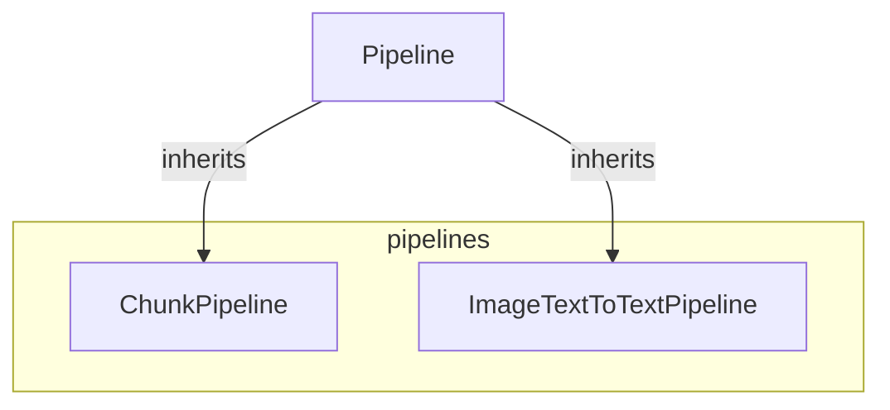

# pipelines
The `pipelines` module provides specialized pipeline implementations for chunk-based processing and image-text-to-text generation, both extending a common `Pipeline` base.

<!-- DIAGRAM_JSON
{
    "nodes": [
        {
            "id": "pipelines",
            "label": "pipelines",
            "type": "module"
        },
        {
            "id": "ChunkPipeline",
            "label": "ChunkPipeline"
        },
        {
            "id": "ImageTextToTextPipeline",
            "label": "ImageTextToTextPipeline"
        },
        {
            "id": "Pipeline",
            "label": "Pipeline",
            "style": "fill:#f9f,stroke:#333,stroke-width:2px"
        },
        {
            "id": "base_pipelines",
            "label": "Base Pipeline Utilities",
            "type": "module",
            "link": "base_pipelines.md"
        },
        {
            "id": "image_text_pipelines",
            "label": "Image and Text Generation",
            "type": "module",
            "link": "image_text_pipelines.md"
        }
    ],
    "edges": [
        {
            "source": "Pipeline",
            "target": "ChunkPipeline",
            "type": "inheritance"
        },
        {
            "source": "Pipeline",
            "target": "ImageTextToTextPipeline",
            "type": "inheritance"
        },
        {
            "source": "ChunkPipeline",
            "target": "base_pipelines"
        },
        {
            "source": "ChunkPipeline",
            "target": "image_text_pipelines"
        }
    ],
    "groups": [
        {
            "id": "pipelines__group",
            "label": "pipelines",
            "nodes": [
                "ChunkPipeline",
                "ImageTextToTextPipeline"
            ],
            "_repaired": "r4_group_renamed_avoid_node_collision"
        }
    ]
}
-->
