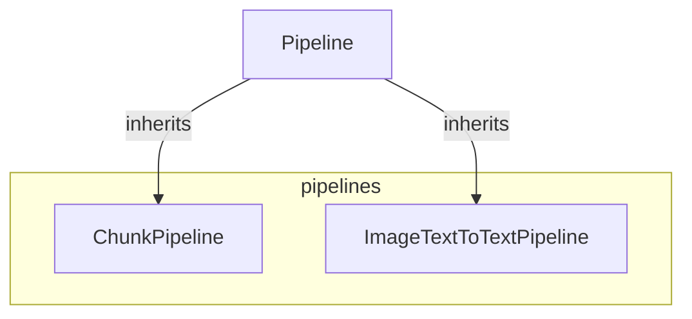

# pipelines
The `pipelines` module provides specialized pipeline implementations for chunk-based processing and image-text-to-text generation, both extending a common `Pipeline` base.

<!-- DIAGRAM_JSON
{
  "nodes": [
    {"id": "ChunkPipeline", "label": "ChunkPipeline"},
    {"id": "ImageTextToTextPipeline", "label": "ImageTextToTextPipeline"},
    {"id": "Pipeline", "label": "Pipeline", "style": "fill:#f9f,stroke:#333,stroke-width:2px"}
  ],
  "edges": [
    {"source": "Pipeline", "target": "ChunkPipeline", "type": "inheritance"},
    {"source": "Pipeline", "target": "ImageTextToTextPipeline", "type": "inheritance"}
  ],
  "groups": [
    {"id": "pipelines", "label": "pipelines", "nodes": ["ChunkPipeline", "ImageTextToTextPipeline"]}
  ]
}
-->
