# Module: `pix2struct_models`

## Introduction
The `pix2struct_models` module is primarily responsible for facilitating the conversion of original Pix2Struct PyTorch checkpoints, initially trained with T5X (Flax), into a Hugging Face compatible format. This enables seamless integration and usage of these models within the Hugging Face Transformers ecosystem, providing standardized model loading, configuration, and processing utilities.

## Core Functionality
The main functionality of this module revolves around the `convert_pix2struct_original_pytorch_checkpoint_to_hf` function. This function takes a T5X checkpoint path and a desired PyTorch dump folder path, then handles the necessary steps to:
1. Load Flax parameters from the T5X checkpoint.
2. Initialize appropriate Pix2Struct configurations (`Pix2StructVisionConfig`, `Pix2StructTextConfig`, `Pix2StructConfig`) based on whether a large model variant is specified.
3. Instantiate a `Pix2StructForConditionalGeneration` model using the generated configuration.
4. Convert and rename the Flax parameters to be compatible with the PyTorch model's state dictionary.
5. Load the converted parameters into the PyTorch model.
6. Initialize a `Pix2StructTokenizer` and `Pix2StructImageProcessor`, which are then combined into a `Pix2StructProcessor`.
7. Configure the image processor for VQA tasks if `is_vqa` is true, and adjust `max_patches` for large models.
8. Save both the converted PyTorch model and the processor to the specified output directory.

## Architecture and Component Relationships

<!-- DIAGRAM_JSON
{
    "direction": "TD",
    "nodes": [
        {"id": "convert_checkpoint", "label": "convert_pix2struct_original_pytorch_checkpoint_to_hf", "type": "component", "link": null},
        {"id": "pix2struct_vision_config", "label": "Pix2StructVisionConfig", "type": "external", "link": null},
        {"id": "pix2struct_text_config", "label": "Pix2StructTextConfig", "type": "external", "link": null},
        {"id": "pix2struct_config", "label": "Pix2StructConfig", "type": "external", "link": null},
        {"id": "pix2struct_model", "label": "Pix2StructForConditionalGeneration", "type": "external", "link": null},
        {"id": "auto_tokenizer", "label": "AutoTokenizer", "type": "external", "link": null},
        {"id": "image_processor", "label": "Pix2StructImageProcessor", "type": "external", "link": null},
        {"id": "processor", "label": "Pix2StructProcessor", "type": "external", "link": null},
        {"id": "flax_utils", "label": "Flax Parameter Utilities", "type": "external", "link": null},
        {"id": "os_module", "label": "OS Module", "type": "external", "link": null}
    ],
    "edges": [
        {"source": "convert_checkpoint", "target": "flax_utils"},
        {"source": "convert_checkpoint", "target": "pix2struct_vision_config"},
        {"source": "convert_checkpoint", "target": "pix2struct_text_config"},
        {"source": "convert_checkpoint", "target": "pix2struct_config"},
        {"source": "convert_checkpoint", "target": "pix2struct_model"},
        {"source": "convert_checkpoint", "target": "auto_tokenizer"},
        {"source": "convert_checkpoint", "target": "image_processor"},
        {"source": "convert_checkpoint", "target": "processor"},
        {"source": "convert_checkpoint", "target": "os_module"}
    ],
    "groups": []
}
-->

```mermaid
graph TD
    convert_checkpoint[convert_pix2struct_original_pytorch_checkpoint_to_hf]
    pix2struct_vision_config[Pix2StructVisionConfig]
    pix2struct_text_config[Pix2StructTextConfig]
    pix2struct_config[Pix2StructConfig]
    pix2struct_model[Pix2StructForConditionalGeneration]
    auto_tokenizer[AutoTokenizer]
    image_processor[Pix2StructImageProcessor]
    processor[Pix2StructProcessor]
    flax_utils[Flax Parameter Utilities]
    os_module[OS Module]

    convert_checkpoint --> flax_utils
    convert_checkpoint --> pix2struct_vision_config
    convert_checkpoint --> pix2struct_text_config
    convert_checkpoint --> pix2struct_config
    convert_checkpoint --> pix2struct_model
    convert_checkpoint --> auto_tokenizer
    convert_checkpoint --> image_processor
    convert_checkpoint --> processor
    convert_checkpoint --> os_module
```

## How the Module Fits into the Overall System
The `pix2struct_models` module acts as an essential bridge for integrating Pix2Struct models, originally developed in T5X/Flax, into the broader Hugging Face ecosystem. This conversion utility allows researchers and developers to leverage pre-trained Pix2Struct models with the familiar and extensive tooling provided by Hugging Face Transformers. It ensures compatibility and simplifies the deployment and fine-tuning of these models for various tasks such as visual question answering (VQA) and general image-to-text generation. This module is a utility for model preparation rather than a runtime component of the core Pix2Struct model inference or training within Hugging Face.
