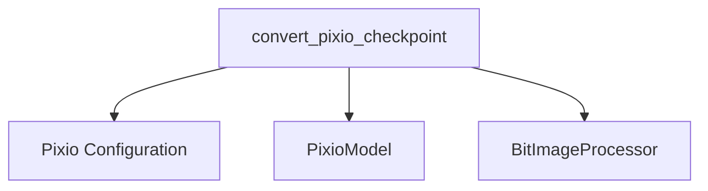

# Pixio Models Documentation

## Introduction

The `pixio_models` module is responsible for handling the conversion of pre-trained Pixio model checkpoints into the Hugging Face PyTorch format. It provides the necessary utilities to adapt weights from external Pixio models to the internal `PixioModel` architecture, enabling seamless integration and usage within the Hugging Face ecosystem.

## Architecture and Component Relationships

This module primarily consists of the `convert_pixio_checkpoint` function, which orchestrates the entire conversion process. It interacts with core Pixio model components, configuration utilities, and image processing functionalities to ensure a correct and verifiable conversion.

<!-- DIAGRAM_JSON
{
    "direction": "TD",
    "nodes": [
        {"id": "convert_pixio_checkpoint", "label": "convert_pixio_checkpoint", "type": "component", "link": null},
        {"id": "pixio_model", "label": "PixioModel", "type": "component", "link": null},
        {"id": "pixio_config", "label": "Pixio Configuration", "type": "component", "link": null},
        {"id": "image_processor", "label": "BitImageProcessor", "type": "external", "link": "image_utilities.md"}
    ],
    "edges": [
        {"source": "convert_pixio_checkpoint", "target": "pixio_config"},
        {"source": "convert_pixio_checkpoint", "target": "pixio_model"},
        {"source": "convert_pixio_checkpoint", "target": "image_processor"}
    ],
    "groups": []
}
-->

### Core Functionality: `convert_pixio_checkpoint`

`convert_pixio_checkpoint` is the main entry point for converting Pixio model weights. It performs the following key steps:

1.  **Configuration Loading**: Retrieves the default Pixio configuration based on the provided `model_name` using `get_pixio_config`.
2.  **Checkpoint Loading**: Loads the raw state dictionary from the external Pixio checkpoint file.
3.  **Key Renaming**: Applies a series of key remapping rules (`create_rename_keys`, `rename_key`) to align the external checkpoint's keys with the Hugging Face `PixioModel`'s expected structure.
4.  **Weight Adaptation**: Specifically handles the conversion of attention mechanism weights (Q, K, V) using `read_in_q_k_v`.
5.  **Model Instantiation and Loading**: Initializes a `PixioModel` instance with the loaded configuration and then loads the adapted state dictionary.
6.  **Image Processing**: Prepares a sample image and initializes a `BitImageProcessor` (refer to [image_utilities.md](image_utilities.md) for more details on image processing) to demonstrate the model's functionality.
7.  **Verification**: Performs a forward pass with the converted model and prints outputs, allowing for verification of the conversion's correctness.
8.  **Saving and Pushing**: Optionally saves the converted model and image processor to a specified local folder or pushes them directly to the Hugging Face Model Hub.

## Integration with the Overall System

The `pixio_models` module plays a crucial role in enabling interoperability by allowing the integration of Pixio models trained in other frameworks into the Hugging Face ecosystem. By providing a standardized conversion process, it ensures that these models can be easily loaded, fine-tuned, and deployed using Hugging Face's tools and libraries.

It depends on general image processing utilities, such as `BitImageProcessor`, which are documented in the [image_utilities.md](image_utilities.md) module. The output of this module, a Hugging Face `PixioModel` and its corresponding `BitImageProcessor`, can then be used by other modules for various downstream tasks like image classification, object detection, or other computer vision applications.