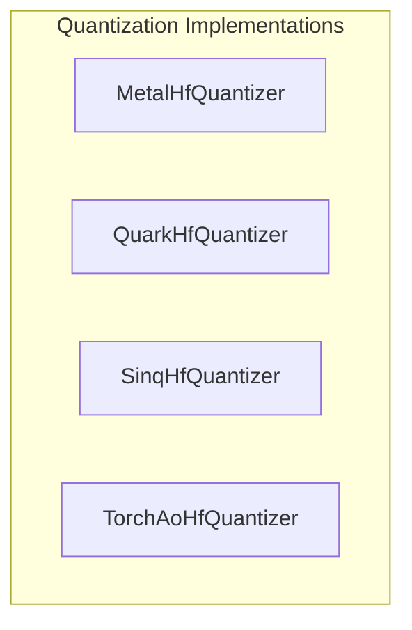

# platform_and_advanced_quantization
This module offers specialized `HfQuantizer` implementations for platform-specific (Metal, Quark) and advanced (SINQ, TorchAO) quantization, enabling efficient low-bit model deployment across diverse hardware.

<!-- DIAGRAM_JSON
{
  "nodes": [
    {
      "id": "MetalHfQuantizer",
      "label": "MetalHfQuantizer"
    },
    {
      "id": "QuarkHfQuantizer",
      "label": "QuarkHfQuantizer"
    },
    {
      "id": "SinqHfQuantizer",
      "label": "SinqHfQuantizer"
    },
    {
      "id": "TorchAoHfQuantizer",
      "label": "TorchAoHfQuantizer"
    }
  ],
  "edges": [],
  "groups": [
    {
      "id": "quantization_implementations",
      "label": "Quantization Implementations",
      "nodes": [
        "MetalHfQuantizer",
        "QuarkHfQuantizer",
        "SinqHfQuantizer",
        "TorchAoHfQuantizer"
      ]
    }
  ]
}
-->
