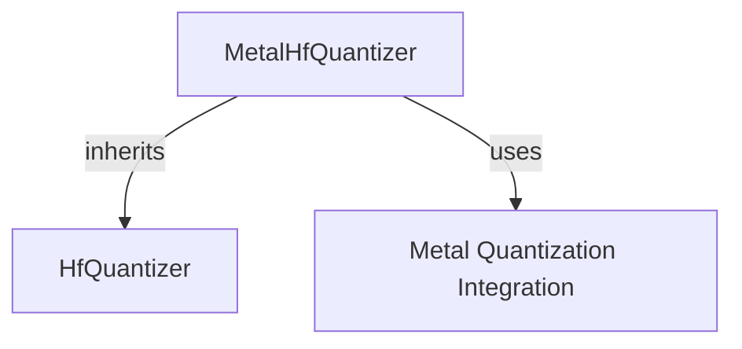

# `platform_specific_quantizers`

The `platform_specific_quantizers` module provides specialized quantization implementations tailored for specific hardware platforms. Currently, it primarily focuses on **Metal affine quantization** for Apple Silicon (MPS) devices.

## Purpose and Core Functionality

This module offers a concrete implementation for leveraging platform-specific hardware capabilities to accelerate model inference through quantization. The core functionality revolves around the `MetalHfQuantizer` class, which enables efficient low-bit quantization on Apple Silicon GPUs.

### `MetalHfQuantizer`

`MetalHfQuantizer` is a specialized quantizer designed for Metal affine quantization. It utilizes the `quantization-mlx` Metal kernels to pack model weights into low-bit (2/4/8-bit) `uint32` tensors, complete with per-group scales and biases. During the forward pass, it performs a fused dequantization and matrix multiplication operation, optimizing performance on MPS devices.

**Key Features:**

*   **MPS Optimization**: Directly targets Apple Silicon GPUs for accelerated quantized inference.
*   **Low-bit Quantization**: Supports 2-bit, 4-bit, and 8-bit quantization.
*   **Fused Operations**: Combines dequantization and matrix multiplication for efficiency.
*   **Environment Validation**: Includes checks to ensure the MPS device is available and necessary `kernels` library is installed.
*   **Device Map Integration**: Automatically configures the `device_map` to `mps` if not explicitly set.
*   **Integration with `MetalLinear`**: Replaces standard linear layers with `MetalLinear` for optimized computation during model processing.

## Architecture and Component Relationships

The `platform_specific_quantizers` module contains the `MetalHfQuantizer` which extends the base `HfQuantizer` from the `quantizers` module. It heavily relies on components within the [integrations module](integrations.md), specifically those related to `metal_quantization`, to perform the actual weight packing, dequantization, and specialized linear operations.

<!-- DIAGRAM_JSON
{
    "direction": "TD",
    "nodes": [
        {"id": "metal_hf_quantizer", "label": "MetalHfQuantizer", "type": "component", "link": null},
        {"id": "hf_quantizer", "label": "HfQuantizer", "type": "external", "link": "quantizers.md"},
        {"id": "metal_quantization_integration", "label": "Metal Quantization Integration", "type": "external", "link": "integrations.md"}
    ],
    "edges": [
        {"source": "metal_hf_quantizer", "target": "hf_quantizer", "label": "inherits"},
        {"source": "metal_hf_quantizer", "target": "metal_quantization_integration", "label": "uses"}
    ],
    "groups": []
}
-->

## How the Module Fits into the Overall System

The `platform_specific_quantizers` module is a leaf module within the broader [quantizers module](quantizers.md) hierarchy. It provides a platform-specific optimization layer, allowing models to be run with higher efficiency on Apple Silicon hardware. When a model is loaded with a Metal-compatible quantization configuration, the `MetalHfQuantizer` intercepts the loading process, modifies the model architecture (e.g., replacing `Linear` layers with `MetalLinear`), and applies the necessary quantization schemes. This ensures that the model can leverage the specialized Metal kernels for improved performance without requiring manual intervention from the user, provided the environment is correctly set up with MPS and the `kernels` library.

This module complements the general quantization framework by offering a highly optimized solution for a particular hardware architecture, making the overall system more versatile and performant across different deployment environments.