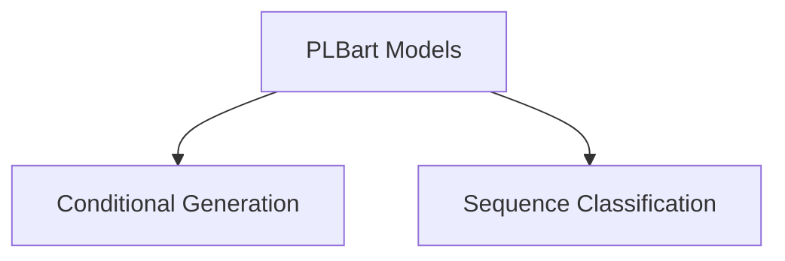

# PLBart Models Documentation

The `plbart_models` module provides implementations of the PLBart (Pre-trained Language Bart) model for various natural language processing tasks. PLBart is a multilingual sequence-to-sequence model suitable for tasks like sequence classification and conditional text generation.

## Architecture Overview

The `plbart_models` module is composed of key sub-modules that handle specific functionalities of the PLBart architecture. The main components facilitate sequence classification and conditional generation tasks.

<!-- DIAGRAM_JSON
{
    "direction": "TD",
    "nodes": [
        {"id": "conditional_generation", "label": "Conditional Generation", "type": "module", "link": "conditional_generation.md"},
        {"id": "sequence_classification", "label": "Sequence Classification", "type": "module", "link": "sequence_classification.md"}
    ],
    "edges": [
        {"source": "plbart_models", "target": "conditional_generation"},
        {"source": "plbart_models", "target": "sequence_classification"}
    ],
    "groups": []
}
-->

## Sub-modules

### [Conditional Generation](conditional_generation.md)
This sub-module focuses on the `PLBartForConditionalGeneration` component, enabling the model to perform tasks such as translation, summarization, and other sequence-to-sequence generation tasks.

### [Sequence Classification](sequence_classification.md)
This sub-module encompasses the `PLBartForSequenceClassification` component, providing functionality for classifying sequences of text, often used in tasks like sentiment analysis or spam detection.