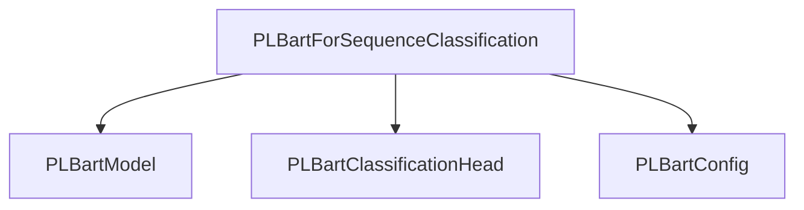

# PLBart Sequence Classification Module Documentation

## Introduction

The `plbart_models.sequence_classification` module provides the capability to perform sequence classification tasks using the PLBart model architecture. Its primary component, `PLBartForSequenceClassification`, extends the foundational PLBart model with a classification head, enabling it to predict labels for input sequences.

This module is crucial for applications requiring natural language understanding, such as sentiment analysis, topic classification, and intent recognition, by leveraging the powerful sequence-to-sequence capabilities of PLBart for discriminative tasks.

## Core Functionality: `PLBartForSequenceClassification`

### Purpose

The `PLBartForSequenceClassification` class is designed to adapt the pre-trained PLBart model for sequence classification or regression. It takes the output of the PLBart encoder-decoder model and feeds it into a classification head to produce logits for various classes or a regression value.

### Architecture and Component Relationships

The `PLBartForSequenceClassification` model integrates several key components:

*   **`PLBartModel`**: The core PLBart encoder-decoder model, responsible for processing input sequences and generating hidden states. This is inherited from the broader `plbart_models` module.
*   **`PLBartClassificationHead`**: A linear classification layer that takes the representation of the sequence (specifically, the last hidden state corresponding to the `eos_token_id`) and maps it to the number of output labels.
*   **`PLBartConfig`**: The configuration object that holds hyperparameters and architectural details for the PLBart model and its classification head, such as `d_model`, `num_labels`, and `classifier_dropout`.

<!-- DIAGRAM_JSON
{
    "direction": "TD",
    "nodes": [
        {"id": "plbart_for_sequence_classification", "label": "PLBartForSequenceClassification", "type": "component", "link": null},
        {"id": "plbart_model", "label": "PLBartModel", "type": "external", "link": "plbart_models.md"},
        {"id": "plbart_classification_head", "label": "PLBartClassificationHead", "type": "external", "link": "plbart_models.md"},
        {"id": "plbart_config", "label": "PLBartConfig", "type": "external", "link": "plbart_models.md"}
    ],
    "edges": [
        {"source": "plbart_for_sequence_classification", "target": "plbart_model"},
        {"source": "plbart_for_sequence_classification", "target": "plbart_classification_head"},
        {"source": "plbart_for_sequence_classification", "target": "plbart_config"}
    ],
    "groups": []
}
-->


### `PLBartForSequenceClassification` Class Details

```python
class PLBartForSequenceClassification(PLBartPreTrainedModel):
    def __init__(self, config: PLBartConfig, **kwargs):
        super().__init__(config, **kwargs)
        self.model = PLBartModel(config)
        self.classification_head = PLBartClassificationHead(
            config.d_model,
            config.d_model,
            config.num_labels,
            config.classifier_dropout,
        )
        self.post_init()

    def forward(
        self,
        input_ids: torch.LongTensor | None = None,
        attention_mask: torch.Tensor | None = None,
        decoder_input_ids: torch.LongTensor | None = None,
        decoder_attention_mask: torch.LongTensor | None = None,
        encoder_outputs: list[torch.FloatTensor] | None = None,
        inputs_embeds: torch.FloatTensor | None = None,
        decoder_inputs_embeds: torch.FloatTensor | None = None,
        labels: torch.LongTensor | None = None,
        use_cache: bool | None = None,
        **kwargs: Unpack[TransformersKwargs],
    ) -> tuple | Seq2SeqSequenceClassifierOutput:
        # ... (implementation details as provided in the core component)
        pass
```

#### `__init__` Method

The constructor initializes the `PLBartModel` (the base encoder-decoder) and the `PLBartClassificationHead`. It takes a `PLBartConfig` object to configure these components, including the model dimensions, number of labels, and dropout rates for the classifier.

#### `forward` Method

The `forward` method processes input sequences to produce classification logits and, optionally, compute the loss. Key aspects include:

*   **Input Handling**: It accepts various inputs like `input_ids`, `attention_mask`, `decoder_input_ids`, `labels`, etc., similar to a standard sequence-to-sequence model.
*   **PLBart Model Pass**: It first passes the inputs through the `self.model` (the `PLBartModel`) to obtain the hidden states.
*   **Sequence Representation**: It extracts a sentence-level representation by identifying the last hidden state corresponding to the `eos_token_id` (end-of-sequence token). This representation is then used for classification.
*   **Classification Head**: The extracted sentence representation is passed to `self.classification_head` to compute the raw classification `logits`.
*   **Loss Computation**: If `labels` are provided, the method computes a loss based on the `problem_type` specified in the `config` (regression, single-label classification, or multi-label classification) using appropriate loss functions (MSELoss, CrossEntropyLoss, BCEWithLogitsLoss).
*   **Output**: Returns a `Seq2SeqSequenceClassifierOutput` object containing the computed `loss` (if `labels` were provided), `logits`, and other outputs from the underlying `PLBartModel`.

### How it fits into the overall system

The `plbart_models.sequence_classification` module, specifically `PLBartForSequenceClassification`, is a specialized application of the general [plbart_models](plbart_models.md) architecture. It allows the PLBart model to be fine-tuned or used directly for discriminative tasks rather than generative ones (like translation or summarization). It leverages the robust feature extraction capabilities of the PLBart encoder to create meaningful sequence representations, which are then classified.

This module is typically used in the downstream tasks of the `transformers` library, where users can load pre-trained `PLBartForSequenceClassification` models or train new ones on custom datasets for sequence-level predictions. Its design promotes reusability of the core PLBart model while providing a convenient interface for classification problems.