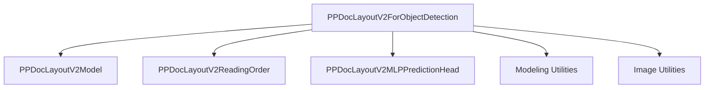

# pp_doclayout_v2_models Module Documentation

## Introduction

The `pp_doclayout_v2_models` module provides the `PPDocLayoutV2ForObjectDetection` model, specifically designed for object detection in document layouts. This model enables the identification and localization of various document elements such as text, titles, tables, and images, facilitating automated document understanding and processing.

## Core Functionality

The primary component of this module, `PPDocLayoutV2ForObjectDetection`, is built upon a transformer-based architecture for performing object detection on document images. It extends a pre-trained model and incorporates a reading order prediction mechanism to understand the spatial relationships between detected elements. The model is capable of processing images, predicting bounding boxes and class labels for various layout components.

**Key Features:**

*   **Document Layout Object Detection:** Detects and classifies different regions within a document, such as paragraphs, titles, footnotes, and figures.
*   **Reading Order Prediction:** Includes a `PPDocLayoutV2ReadingOrder` component to infer the logical reading order of the detected objects, which is crucial for downstream tasks like text extraction or document summarization.
*   **Pre-trained Model Integration:** Leverages a pre-trained `PPDocLayoutV2Model` for robust feature extraction and attention mechanisms.
*   **Inference-focused:** The current implementation of `PPDocLayoutV2ForObjectDetection` is designed for inference, providing capabilities to process document images and output structured layout information.

## Architecture and Component Relationships

The `pp_doclayout_v2_models` module's architecture is centered around the `PPDocLayoutV2ForObjectDetection` class, which orchestrates the object detection and reading order prediction processes.

<!-- DIAGRAM_JSON
{
    "direction": "TD",
    "nodes": [
        {"id": "pp_doclayout_v2_for_object_detection", "label": "PPDocLayoutV2ForObjectDetection", "type": "component", "link": null},
        {"id": "pp_doclayout_v2_model", "label": "PPDocLayoutV2Model", "type": "component", "link": null},
        {"id": "pp_doclayout_v2_reading_order", "label": "PPDocLayoutV2ReadingOrder", "type": "component", "link": null},
        {"id": "pp_doclayout_v2_mlp_prediction_head", "label": "PPDocLayoutV2MLPPredictionHead", "type": "component", "link": null},
        {"id": "modeling_utilities", "label": "Modeling Utilities", "type": "external", "link": "modeling_utilities.md"},
        {"id": "image_utilities", "label": "Image Utilities", "type": "external", "link": "image_utilities.md"}
    ],
    "edges": [
        {"source": "pp_doclayout_v2_for_object_detection", "target": "pp_doclayout_v2_model"},
        {"source": "pp_doclayout_v2_for_object_detection", "target": "pp_doclayout_v2_reading_order"},
        {"source": "pp_doclayout_v2_for_object_detection", "target": "pp_doclayout_v2_mlp_prediction_head"},
        {"source": "pp_doclayout_v2_for_object_detection", "target": "modeling_utilities"},
        {"source": "pp_doclayout_v2_for_object_detection", "target": "image_utilities"}
    ],
    "groups": []
}
-->

**Components:**

*   `PPDocLayoutV2ForObjectDetection`: The main class of this module. It initializes and coordinates the `PPDocLayoutV2Model` and `PPDocLayoutV2ReadingOrder` for performing document layout analysis.
*   `PPDocLayoutV2Model`: (Internal) The core model architecture responsible for feature extraction and multi-head attention mechanisms, forming the backbone of the object detection process.
*   `PPDocLayoutV2ReadingOrder`: (Internal) A dedicated component that takes the detected bounding boxes and labels to predict their logical reading order within the document.
*   `PPDocLayoutV2MLPPredictionHead`: (Internal) A multi-layer perceptron-based prediction head used by the `PPDocLayoutV2Model` for regressing bounding box coordinates.

**External Dependencies:**

*   [Modeling Utilities](modeling_utilities.md): This module relies on a base `PPDocLayoutV2PreTrainedModel` class and `PPDocLayoutV2Config` for configuration, both of which are expected to be provided by a common `modeling_utilities` module.
*   [Image Utilities](image_utilities.md): For image pre-processing and post-processing steps, such as those performed by `AutoImageProcessor` in the example, the module interfaces with functionalities typically found in an `image_utilities` module.

## System Integration

The `pp_doclayout_v2_models` module fits into a broader ecosystem of models and utilities designed for document understanding and processing. It provides a specialized object detection capability that can be integrated into various workflows requiring structured information extraction from documents.

Given its inference-focused nature, this module is typically used as a component in larger applications where pre-trained models are loaded to analyze new document images. The outputs, including detected objects with their labels, bounding boxes, and reading order, can then be used for tasks such as:

*   **Automated Data Extraction:** Extracting key information from forms, invoices, or reports.
*   **Document Digitization and Archiving:** Converting scanned documents into searchable and editable formats.
*   **Accessibility Enhancements:** Providing structured content for screen readers or other assistive technologies.
*   **Document Content Analysis:** Understanding the composition and flow of information within complex documents.

By providing a robust solution for document layout analysis, `pp_doclayout_v2_models` contributes a crucial building block for advanced document intelligence systems.