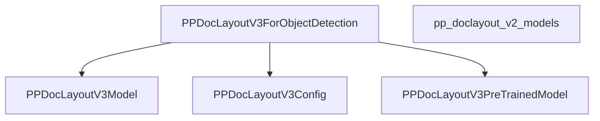

# pp_doclayout_v3_models Module Documentation

This document provides comprehensive documentation for the `pp_doclayout_v3_models` module, outlining its purpose, architecture, and how it integrates within the larger system.

The `pp_doclayout_v3_models` module is designed to provide functionalities for object detection in document layouts, building upon previous iterations. It primarily focuses on inference tasks related to identifying and categorizing elements within document images.

## Architecture and Component Relationships

The core of the `pp_doclayout_v3_models` module is the `PPDocLayoutV3ForObjectDetection` class. This class serves as the main entry point for performing document layout object detection. It is built upon the `PPDocLayoutV3PreTrainedModel` and internally utilizes `PPDocLayoutV3Model` for its primary modeling capabilities, configured by `PPDocLayoutV3Config`.

The module's architecture is structured to efficiently handle the processing of document images, identifying elements such as text, titles, footnotes, and numbers. It is specifically tailored for inference, as indicated by its design that does not support training directly.

### Internal Components

*   **`PPDocLayoutV3ForObjectDetection`**: This is the primary class responsible for orchestrating the object detection process. It initializes and utilizes the core model and configuration, and provides the `forward` method for inference.
*   **`PPDocLayoutV3Model`**: This component represents the underlying model architecture responsible for the actual feature extraction and prediction mechanisms. `PPDocLayoutV3ForObjectDetection` delegates the main processing to this model.
*   **`PPDocLayoutV3Config`**: This component encapsulates the configuration parameters required by `PPDocLayoutV3Model` and `PPDocLayoutV3ForObjectDetection`, defining aspects such as the number of labels, model dimensions, and query parameters.
*   **`PPDocLayoutV3PreTrainedModel`**: This is the base class from which `PPDocLayoutV3ForObjectDetection` inherits, providing common functionalities and utilities for pre-trained models within the system.

### External Dependencies

The `pp_doclayout_v3_models` module may depend on previous versions, such as `pp_doclayout_v2_models`, for certain functionalities or architectural patterns. It also relies on standard PyTorch libraries for neural network operations.

### System Integration

The `pp_doclayout_v3_models` module integrates into the broader system by providing a specialized object detection capability for document understanding. It can be used in pipelines where document images need to be analyzed for their structural components, serving as a critical step in automated document processing workflows. Users can leverage the `transformers` library's `AutoModelForObjectDetection` and `AutoImageProcessor` to easily load and utilize this model for inference.

<!-- DIAGRAM_JSON
{
    "direction": "TD",
    "nodes": [
        {"id": "PPDocLayoutV3ForObjectDetection", "label": "PPDocLayoutV3ForObjectDetection", "type": "component", "link": null},
        {"id": "PPDocLayoutV3Model", "label": "PPDocLayoutV3Model", "type": "component", "link": null},
        {"id": "PPDocLayoutV3Config", "label": "PPDocLayoutV3Config", "type": "component", "link": null},
        {"id": "PPDocLayoutV3PreTrainedModel", "label": "PPDocLayoutV3PreTrainedModel", "type": "component", "link": null},
        {"id": "pp_doclayout_v2_models", "label": "pp_doclayout_v2_models", "type": "external", "link": "pp_doclayout_v2_models.md"}
    ],
    "edges": [
        {"source": "PPDocLayoutV3ForObjectDetection", "target": "PPDocLayoutV3Model"},
        {"source": "PPDocLayoutV3ForObjectDetection", "target": "PPDocLayoutV3Config"},
        {"source": "PPDocLayoutV3ForObjectDetection", "target": "PPDocLayoutV3PreTrainedModel"}
    ],
    "groups": []
}
-->
