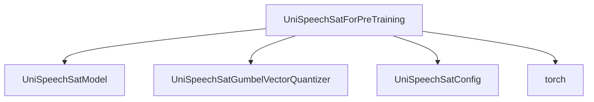

# Pretraining Module

The `pretraining` module is a crucial component within the `unispeech_sat_models` family, specifically designed for the pre-training phase of UniSpeechSat models. It encapsulates the logic for feature extraction, quantization, and the contrastive learning objective, which are fundamental to self-supervised speech representation learning.

## Architecture and Component Relationships

<!-- DIAGRAM_JSON
{
    "direction": "TD",
    "nodes": [
        {"id": "unispeech_sat_pretraining", "label": "UniSpeechSatForPreTraining", "type": "component", "link": null},
        {"id": "unispeech_sat_model", "label": "UniSpeechSatModel", "type": "external", "link": "unispeech_sat_models.md"},
        {"id": "gumbel_quantizer", "label": "UniSpeechSatGumbelVectorQuantizer", "type": "external", "link": "unispeech_sat_models.md"},
        {"id": "config", "label": "UniSpeechSatConfig", "type": "external", "link": "unispeech_sat_models.md"},
        {"id": "torch", "label": "torch", "type": "external", "link": null}
    ],
    "edges": [
        {"source": "unispeech_sat_pretraining", "target": "unispeech_sat_model"},
        {"source": "unispeech_sat_pretraining", "target": "gumbel_quantizer"},
        {"source": "unispeech_sat_pretraining", "target": "config"},
        {"source": "unispeech_sat_pretraining", "target": "torch"}
    ],
    "groups": []
}
-->

The `UniSpeechSatForPreTraining` class orchestrates the pre-training process. It leverages the core `UniSpeechSatModel` for extracting features from input audio and a `UniSpeechSatGumbelVectorQuantizer` for quantizing these features. The overall architecture focuses on a contrastive learning objective, where the model learns to distinguish between true and negative samples based on the similarity of their representations.

## Core Components

### `UniSpeechSatForPreTraining`

`src.transformers.models.unispeech_sat.modeling_unispeech_sat.UniSpeechSatForPreTraining`

This class is the primary entry point for pre-training UniSpeechSat models. It initializes the necessary sub-modules and defines the forward pass for computing pre-training loss and logits.

**Key Attributes:**

*   `unispeech_sat`: An instance of `UniSpeechSatModel` for audio feature extraction.
*   `dropout_features`, `dropout`: Dropout layers for regularization.
*   `quantizer`: An instance of `UniSpeechSatGumbelVectorQuantizer` for discretizing features.
*   `project_q`, `project_hid`: Linear layers for projecting quantized and hidden features.
*   `speaker_proj`: Linear layer for speaker projection.
*   `label_embeddings_concat`: Learnable embeddings for concatenation.
*   `layer_norm_for_extract`: Layer normalization for extracted features.

**Key Methods:**

*   `__init__(self, config: UniSpeechSatConfig)`: Initializes the pre-training model with a given configuration.
*   `set_gumbel_temperature(self, temperature: int)`: Sets the temperature for the Gumbel softmax, crucial for training the quantizer.
*   `freeze_feature_encoder(self)`: Disables gradient computation for the feature encoder, allowing its parameters to remain fixed during certain training phases.
*   `compute_contrastive_logits(target_features, negative_features, predicted_features, temperature=1)`: A static method to compute contrastive logits using cosine similarity. This is a core part of the self-supervised learning objective.
*   `forward(...)`: Defines the forward pass of the model. It takes `input_values` (audio input) and other optional parameters, processes them through the `unispeech_sat` model, extracts and quantizes features, and returns the pre-training output, including loss, logits, and various feature representations.

## How it Fits into the Overall System

The `pretraining` module is an integral part of the `unispeech_sat_models` ecosystem. It provides the foundational self-supervised pre-training capabilities that allow UniSpeechSat models to learn robust speech representations from unlabeled audio data. These pre-trained models can then be fine-tuned for various downstream tasks like speech recognition, speaker verification, or sentiment analysis. It relies on the core `unispeech_sat_models.UniSpeechSatModel` for the backbone architecture and `unispeech_sat_models.UniSpeechSatGumbelVectorQuantizer` for the quantization mechanism. It is configured by `unispeech_sat_models.UniSpeechSatConfig`.