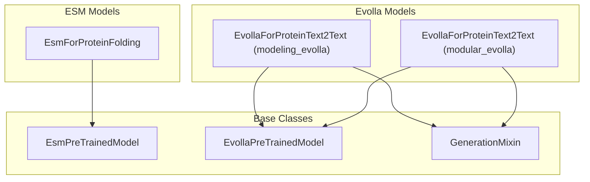

# protein_models
The `protein_models` module provides classes for protein structure prediction and protein-text interaction, including an ESM-based protein folding model and Evolla models for protein-text generation.

<!-- DIAGRAM_JSON
{
    "nodes": [
        {
            "id": "EsmForProteinFolding",
            "label": "EsmForProteinFolding"
        },
        {
            "id": "EvollaForProteinText2Text_modeling",
            "label": "EvollaForProteinText2Text (modeling_evolla)"
        },
        {
            "id": "EvollaForProteinText2Text_modular",
            "label": "EvollaForProteinText2Text (modular_evolla)"
        },
        {
            "id": "EsmPreTrainedModel",
            "label": "EsmPreTrainedModel"
        },
        {
            "id": "EvollaPreTrainedModel",
            "label": "EvollaPreTrainedModel"
        },
        {
            "id": "GenerationMixin",
            "label": "GenerationMixin"
        }
    ],
    "edges": [
        {
            "source": "EsmForProteinFolding",
            "target": "EsmPreTrainedModel",
            "label": "inherits"
        },
        {
            "source": "EvollaForProteinText2Text_modeling",
            "target": "EvollaPreTrainedModel",
            "label": "inherits"
        },
        {
            "source": "EvollaForProteinText2Text_modeling",
            "target": "GenerationMixin",
            "label": "inherits"
        },
        {
            "source": "EvollaForProteinText2Text_modular",
            "target": "EvollaPreTrainedModel",
            "label": "inherits"
        },
        {
            "source": "EvollaForProteinText2Text_modular",
            "target": "GenerationMixin",
            "label": "inherits"
        }
    ],
    "groups": [
        {
            "id": "esm_group",
            "label": "ESM Models",
            "nodes": [
                "EsmForProteinFolding"
            ]
        },
        {
            "id": "evolla_group",
            "label": "Evolla Models",
            "nodes": [
                "EvollaForProteinText2Text_modeling",
                "EvollaForProteinText2Text_modular"
            ]
        },
        {
            "id": "base_group",
            "label": "Base Classes",
            "nodes": [
                "EsmPreTrainedModel",
                "EvollaPreTrainedModel",
                "GenerationMixin"
            ]
        }
    ]
}
-->
