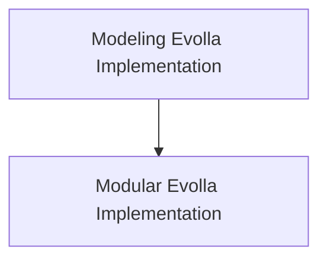

# Protein Text-to-Text Models

## Introduction

The `protein_text_to_text_models` module, a sub-module of `evolla_models`, is designed to handle text-to-text generation tasks specifically tailored for protein-related information. It provides implementations of the `EvollaForProteinText2Text` model, enabling the generation of textual responses based on provided protein sequences and contextual questions.

## Architecture

This module primarily consists of two distinct implementations of the `EvollaForProteinText2Text` model, each residing in a different sub-module. These implementations share core functionality but may differ in their underlying structure or modularity.

<!-- DIAGRAM_JSON
{
    "direction": "TD",
    "nodes": [
        {"id": "modeling_evolla_implementation", "label": "Modeling Evolla Implementation", "type": "module", "link": "modeling_evolla_implementation.md"},
        {"id": "modular_evolla_implementation", "label": "Modular Evolla Implementation", "type": "module", "link": "modular_evolla_implementation.md"}
    ],
    "edges": [
        {"source": "modeling_evolla_implementation", "target": "modular_evolla_implementation"}
    ],
    "groups": []
}
-->

## Sub-modules

### [Modeling Evolla Implementation](modeling_evolla_implementation.md)
This sub-module contains an implementation of the `EvollaForProteinText2Text` model, focusing on the core modeling aspects.

### [Modular Evolla Implementation](modular_evolla_implementation.md)
This sub-module provides a modular approach to the `EvollaForProteinText2Text` model, potentially offering greater flexibility and reusability.