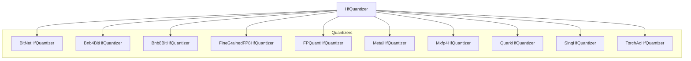

# Quantization Module
This module provides various quantization strategies for optimizing model size and inference speed, including BitNet, BitsAndBytes (4-bit and 8-bit), FP8, FP-Quant, Metal, MXFP4, Quark, SINQ, and TorchAO methods. It offers specialized quantizers for different hardware and precision requirements.

<!-- DIAGRAM_JSON
{
    "nodes": [
        {
            "id": "quantization",
            "label": "Quantization",
            "type": "module"
        },
        {
            "id": "HfQuantizer",
            "label": "HfQuantizer"
        },
        {
            "id": "BitNetHfQuantizer",
            "label": "BitNetHfQuantizer"
        },
        {
            "id": "Bnb4BitHfQuantizer",
            "label": "Bnb4BitHfQuantizer"
        },
        {
            "id": "Bnb8BitHfQuantizer",
            "label": "Bnb8BitHfQuantizer"
        },
        {
            "id": "FineGrainedFP8HfQuantizer",
            "label": "FineGrainedFP8HfQuantizer"
        },
        {
            "id": "FPQuantHfQuantizer",
            "label": "FPQuantHfQuantizer"
        },
        {
            "id": "MetalHfQuantizer",
            "label": "MetalHfQuantizer"
        },
        {
            "id": "Mxfp4HfQuantizer",
            "label": "Mxfp4HfQuantizer"
        },
        {
            "id": "QuarkHfQuantizer",
            "label": "QuarkHfQuantizer"
        },
        {
            "id": "SinqHfQuantizer",
            "label": "SinqHfQuantizer"
        },
        {
            "id": "TorchAoHfQuantizer",
            "label": "TorchAoHfQuantizer"
        },
        {
            "id": "general_quantization",
            "label": "General Quantization Methods",
            "type": "module",
            "link": "general_quantization.md"
        },
        {
            "id": "platform_and_advanced_quantization",
            "label": "Platform and Advanced Quantization",
            "type": "module",
            "link": "platform_and_advanced_quantization.md"
        }
    ],
    "edges": [
        {
            "source": "HfQuantizer",
            "target": "BitNetHfQuantizer",
            "label": "inherits"
        },
        {
            "source": "HfQuantizer",
            "target": "Bnb4BitHfQuantizer",
            "label": "inherits"
        },
        {
            "source": "HfQuantizer",
            "target": "Bnb8BitHfQuantizer",
            "label": "inherits"
        },
        {
            "source": "HfQuantizer",
            "target": "FineGrainedFP8HfQuantizer",
            "label": "inherits"
        },
        {
            "source": "HfQuantizer",
            "target": "FPQuantHfQuantizer",
            "label": "inherits"
        },
        {
            "source": "HfQuantizer",
            "target": "MetalHfQuantizer",
            "label": "inherits"
        },
        {
            "source": "HfQuantizer",
            "target": "Mxfp4HfQuantizer",
            "label": "inherits"
        },
        {
            "source": "HfQuantizer",
            "target": "QuarkHfQuantizer",
            "label": "inherits"
        },
        {
            "source": "HfQuantizer",
            "target": "SinqHfQuantizer",
            "label": "inherits"
        },
        {
            "source": "HfQuantizer",
            "target": "TorchAoHfQuantizer",
            "label": "inherits"
        },
        {
            "source": "quantization",
            "target": "general_quantization"
        },
        {
            "source": "quantization",
            "target": "platform_and_advanced_quantization"
        }
    ],
    "groups": [
        {
            "id": "Quantizers",
            "label": "Quantizers",
            "nodes": [
                "BitNetHfQuantizer",
                "Bnb4BitHfQuantizer",
                "Bnb8BitHfQuantizer",
                "FineGrainedFP8HfQuantizer",
                "FPQuantHfQuantizer",
                "MetalHfQuantizer",
                "Mxfp4HfQuantizer",
                "QuarkHfQuantizer",
                "SinqHfQuantizer",
                "TorchAoHfQuantizer"
            ]
        }
    ]
}
-->
