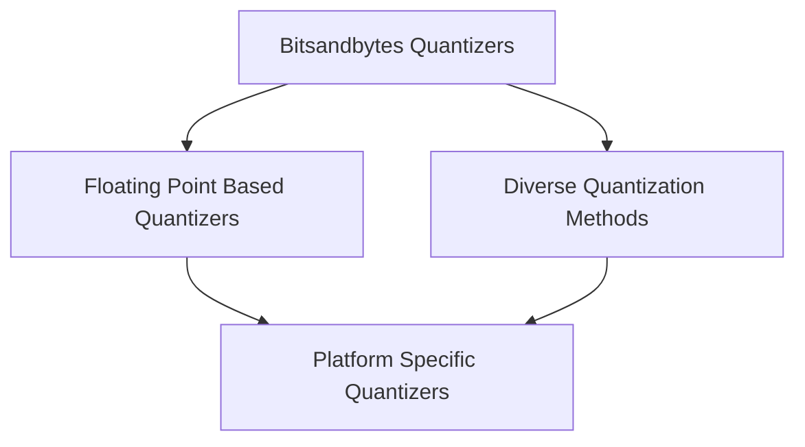

# Quantizers Module

The `quantizers` module provides a comprehensive suite of quantization methods designed to reduce the memory footprint and improve the inference speed of models, often with minimal impact on performance. It integrates various cutting-edge quantization techniques, allowing users to select the most suitable method for their specific hardware and application requirements.

## Architecture

The `quantizers` module is structured around the `HfQuantizer` base class, with each sub-module implementing a specific quantization scheme. This modular design allows for easy integration of new quantization techniques and ensures clear separation of concerns.

The module is composed of the following key sub-modules:

*   **[Bitsandbytes Quantizers](bnb_quantizers.md)**: Focuses on 4-bit and 8-bit quantization using the popular `bitsandbytes` library.
*   **[Floating Point Based Quantizers](fp_based_quantizers.md)**: Implements various floating-point quantization methods, including FP8 and MXFP4.
*   **[Platform Specific Quantizers](platform_specific_quantizers.md)**: Contains quantizers optimized for particular hardware architectures, such as Apple Silicon with Metal quantization.
*   **[Diverse Quantization Methods](other_quantization_methods.md)**: A collection of other advanced and specialized quantization techniques like BitNet, Quark, SINQ, and TorchAO.

<!-- DIAGRAM_JSON
{
    "direction": "TD",
    "nodes": [
        {"id": "bnb_quantizers", "label": "Bitsandbytes Quantizers", "type": "module", "link": "bnb_quantizers.md"},
        {"id": "fp_based_quantizers", "label": "Floating Point Based Quantizers", "type": "module", "link": "fp_based_quantizers.md"},
        {"id": "platform_specific_quantizers", "label": "Platform Specific Quantizers", "type": "module", "link": "platform_specific_quantizers.md"},
        {"id": "other_quantization_methods", "label": "Diverse Quantization Methods", "type": "module", "link": "other_quantization_methods.md"}
    ],
    "edges": [
        {"source": "bnb_quantizers", "target": "fp_based_quantizers"},
        {"source": "bnb_quantizers", "target": "other_quantization_methods"},
        {"source": "fp_based_quantizers", "target": "platform_specific_quantizers"},
        {"source": "other_quantization_methods", "target": "platform_specific_quantizers"}
    ],
    "groups": []
}
-->

