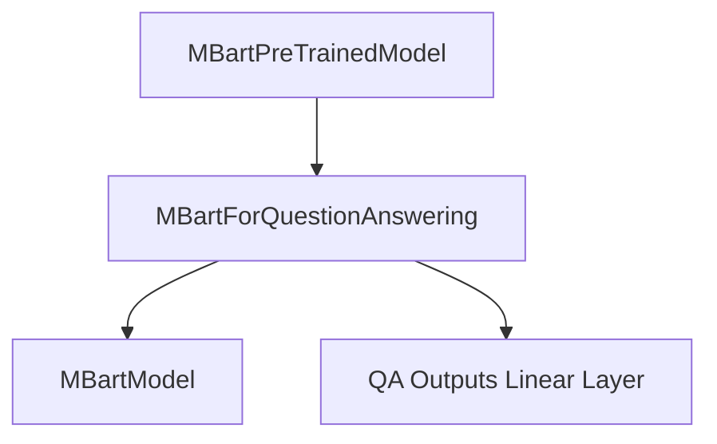

# question_answering Module Documentation

## Introduction

The `question_answering` module provides the `MBartForQuestionAnswering` class, an MBart model specifically designed for question answering tasks. This module leverages the core MBart model architecture and extends it with a question answering head to predict the start and end positions of an answer in a given text.

## Architecture and Component Relationships

The `MBartForQuestionAnswering` class builds upon the foundational `MBartModel` and `MBartPreTrainedModel` from the [mbart_models](mbart_models.md) module. It integrates a linear layer (`qa_outputs`) to project the hidden states of the MBart encoder-decoder architecture into start and end logits for question answering.

<!-- DIAGRAM_JSON
{
    "direction": "TD",
    "nodes": [
        {"id": "mbart_qa", "label": "MBartForQuestionAnswering", "type": "component", "link": null},
        {"id": "qa_outputs_layer", "label": "QA Outputs Linear Layer", "type": "component", "link": null},
        {"id": "mbart_model", "label": "MBartModel", "type": "external", "link": "mbart_models.md"},
        {"id": "mbart_pretrained_model", "label": "MBartPreTrainedModel", "type": "external", "link": "mbart_models.md"}
    ],
    "edges": [
        {"source": "mbart_pretrained_model", "target": "mbart_qa"},
        {"source": "mbart_qa", "target": "mbart_model"},
        {"source": "mbart_qa", "target": "qa_outputs_layer"}
    ],
    "groups": []
}
-->

### Core Components

#### `MBartForQuestionAnswering`

-   **Purpose**: This class is the primary component of the `question_answering` module. It adapts the MBart encoder-decoder model for extractive question answering, where the goal is to find the span of text in a document that answers a given question.
-   **Functionality**:
    -   Initializes an `MBartModel` instance for the core encoder-decoder functionality.
    -   Adds a linear layer (`qa_outputs`) on top of the MBart model's sequence output to predict two logits for each token: one for the start of the answer span and one for the end.
    -   The `forward` method processes input sequences, attention masks, and optionally decoder inputs, generating start and end logits.
    -   When `start_positions` and `end_positions` are provided during training, it calculates the cross-entropy loss for both start and end predictions and returns the combined loss.
    -   It supports returning a `Seq2SeqQuestionAnsweringModelOutput` which includes loss, start logits, end logits, and other model outputs.
-   **Relationships**:
    -   **Inherits from**: `MBartPreTrainedModel` (from [mbart_models](mbart_models.md)).
    -   **Composes**: An instance of `MBartModel` (from [mbart_models](mbart_models.md)).
    -   **Uses**: Standard PyTorch `nn.Linear` for the question answering head and `torch.nn.CrossEntropyLoss` for loss calculation.

### How it Fits into the Overall System

The `question_answering` module, specifically `MBartForQuestionAnswering`, is a specialized application of the broader [mbart_models](mbart_models.md) framework. It enables the MBart architecture to be used for extractive question answering tasks. This module integrates seamlessly into systems requiring advanced natural language understanding and span-based answer extraction capabilities, often as part of larger NLP pipelines. It can be used for tasks such as reading comprehension and information retrieval where precise answer localization is crucial.
