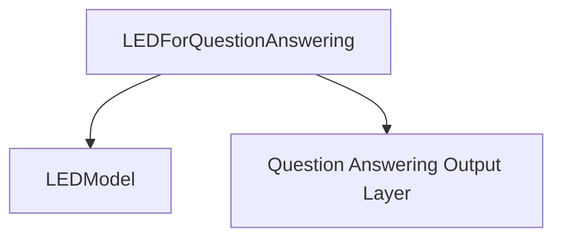

# Module: question_answering_models

## Introduction
This module provides the `LEDForQuestionAnswering` model, specifically designed for question answering tasks using the Longformer-Encoder-Decoder (LED) architecture. It extends the base LED model with a question answering head to predict the start and end positions of answers within a given text.

## Architecture and Component Relationships
The `question_answering_models` module primarily contains the `LEDForQuestionAnswering` class. This class integrates with the core `LEDModel` to leverage its robust encoder-decoder capabilities for processing long documents, and then adds a specialized output layer for span-based question answering.

<!-- DIAGRAM_JSON
{
    "direction": "TD",
    "nodes": [
        {"id": "led_qa_model", "label": "LEDForQuestionAnswering", "type": "component", "link": null},
        {"id": "led_model", "label": "LEDModel", "type": "external", "link": "led_models.md"},
        {"id": "qa_outputs_layer", "label": "Question Answering Output Layer", "type": "component", "link": null}
    ],
    "edges": [
        {"source": "led_qa_model", "target": "led_model"},
        {"source": "led_qa_model", "target": "qa_outputs_layer"}
    ],
    "groups": []
}
-->

### `LEDForQuestionAnswering`
This class inherits from `LEDPreTrainedModel` and encapsulates the full question answering pipeline. It initializes an `LEDModel` to handle the core sequence-to-sequence processing and then adds a linear layer (`qa_outputs`) on top to predict the start and end logits for the answer span.

**Core Functionality:**
- **Initialization**: Sets up the number of labels for start/end positions and instantiates the base `LEDModel` and the `qa_outputs` linear layer.
- **Forward Pass**: Takes input tensors such as `input_ids`, `attention_mask`, `decoder_input_ids`, and crucially, `global_attention_mask` to manage long document contexts. It processes these through the internal `LEDModel` and then uses the `qa_outputs` layer to generate `start_logits` and `end_logits`. If `start_positions` and `end_positions` are provided, it also computes the `CrossEntropyLoss`.

## Integration with the Overall System
This module plays a vital role in providing a specialized question answering capability within the larger system. It builds upon the foundational `led_models` module, specifically utilizing the `LEDModel` for its core encoder-decoder functionality. This allows for efficient reuse of the base model while providing a tailored interface for question answering tasks. Developers can easily integrate `LEDForQuestionAnswering` into applications requiring document-level question answering, leveraging its ability to handle longer sequences due to the LED architecture. Its output, including `start_logits` and `end_logits`, can be directly used for extracting answer spans from text. Developers should refer to the [led_models.md](led_models.md) documentation for details on the base `LEDModel` and its general capabilities.