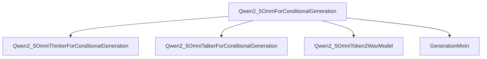

# qwen2_5_omni_models

## Introduction

The `qwen2_5_omni_models` module provides the core implementation for the Qwen2.5-Omni model, a powerful multimodal conditional generation model capable of producing both text and audio outputs. This module integrates various sub-components to achieve its functionality, including a "thinker" for text generation, and a "talker" and "token2wav" for synthesizing speech from generated text.

## Architecture and Component Relationships

This module's primary component is `Qwen2_5OmniForConditionalGeneration`, which orchestrates the entire generation process. It utilizes internal sub-modules for specific tasks:

*   **`Qwen2_5OmniThinkerForConditionalGeneration`**: Responsible for generating textual responses.
*   **`Qwen2_5OmniTalkerForConditionalGeneration`**: Converts generated text into speech tokens.
*   **`Qwen2_5OmniToken2WavModel`**: Synthesizes audio waveforms from speech tokens.

The `Qwen2_5OmniForConditionalGeneration` class inherits functionality from `GenerationMixin` for common generation utilities, which is an external dependency.

<!-- DIAGRAM_JSON
{
    "direction": "TD",
    "nodes": [
        {"id": "qwen2_5_omni_for_conditional_generation", "label": "Qwen2_5OmniForConditionalGeneration", "type": "component", "link": null},
        {"id": "qwen2_5_omni_thinker", "label": "Qwen2_5OmniThinkerForConditionalGeneration", "type": "component", "link": null},
        {"id": "qwen2_5_omni_talker", "label": "Qwen2_5OmniTalkerForConditionalGeneration", "type": "component", "link": null},
        {"id": "qwen2_5_omni_token2wav", "label": "Qwen2_5OmniToken2WavModel", "type": "component", "link": null},
        {"id": "generation_mixin", "label": "GenerationMixin", "type": "external", "link": "generation_mixins.md"}
    ],
    "edges": [
        {"source": "qwen2_5_omni_for_conditional_generation", "target": "qwen2_5_omni_thinker"},
        {"source": "qwen2_5_omni_for_conditional_generation", "target": "qwen2_5_omni_talker"},
        {"source": "qwen2_5_omni_for_conditional_generation", "target": "qwen2_5_omni_token2wav"},
        {"source": "qwen2_5_omni_for_conditional_generation", "target": "generation_mixin"}
    ],
    "groups": []
}
-->

### `Qwen2_5OmniForConditionalGeneration` Class

This is the main model class for Qwen2.5-Omni. It inherits from `Qwen2_5OmniPreTrainedModel` (a base model class within the Qwen2.5-Omni framework) and [GenerationMixin](generation_mixins.md), providing capabilities for conditional text and audio generation. The class handles the initialization and orchestration of its internal components:

*   `__init__(self, config)`: Initializes the `thinker` module and, if `config.enable_audio_output` is true, calls `enable_talker()` to initialize the `talker` and `token2wav` modules.
*   `enable_talker()`: Instantiates `Qwen2_5OmniTalkerForConditionalGeneration` and `Qwen2_5OmniToken2WavModel`, enabling audio output.
*   `load_speakers(self, path)`: Loads speaker embeddings from a specified path, which are crucial for personalized audio generation.
*   `disable_talker()`: Removes the `talker` and `token2wav` modules to disable audio output.
*   `from_pretrained(...)`: A class method that extends the base `from_pretrained` functionality to also load speaker data (`spk_dict.pt`) alongside the model weights.
*   `generate(...)`: The primary method for multimodal generation. It first uses the `thinker` to generate text. If audio output is enabled, it then passes the generated text and hidden states to the `talker` to produce speech tokens, and finally uses `token2wav` to convert these tokens into an audio waveform. It supports various parameters for controlling both text and audio generation.

## How the Module Fits into the Overall System

The `qwen2_5_omni_models` module represents a complete multimodal conditional generation capability within the larger system. It acts as a high-level interface for users to interact with the Qwen2.5-Omni model, allowing them to input multimodal data (implicitly handled by the `thinker`'s input processing) and receive text and/or audio responses. This module is self-contained in terms of its core generation logic, relying on external utilities like `generation_mixins` for standard generation strategies and a custom `Qwen2_5OmniPreTrainedModel` for foundational model functionalities. Its modular design allows for independent development and integration of its `thinker`, `talker`, and `token2wav` components, while providing a unified generation API. 