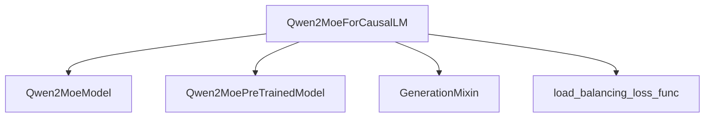

# qwen2_moe_models

## Introduction
The `qwen2_moe_models` module implements the Qwen2 Mixture-of-Experts (MoE) causal language model. This module provides the necessary architecture for building and utilizing Qwen2 MoE models, which are designed for efficient and scalable language generation by routing different parts of the input to specialized "expert" networks.

## Architecture and Component Relationships

The core of this module is the `Qwen2MoeForCausalLM` class, which combines the Qwen2 MoE model architecture with functionalities for causal language modeling and text generation. It leverages a base pretrained model class and integrates a generation mixin for advanced generation capabilities.

<!-- DIAGRAM_JSON
{
    "direction": "TD",
    "nodes": [
        {"id": "qwen2_moe_for_causal_lm", "label": "Qwen2MoeForCausalLM", "type": "component", "link": null},
        {"id": "qwen2_moe_model", "label": "Qwen2MoeModel", "type": "component", "link": null},
        {"id": "qwen2_moe_pretrained_model", "label": "Qwen2MoePreTrainedModel", "type": "component", "link": null},
        {"id": "load_balancing_loss_func", "label": "load_balancing_loss_func", "type": "component", "link": null},
        {"id": "generation_mixin", "label": "GenerationMixin", "type": "external", "link": "generation_mixins.md"}
    ],
    "edges": [
        {"source": "qwen2_moe_for_causal_lm", "target": "qwen2_moe_model"},
        {"source": "qwen2_moe_for_causal_lm", "target": "qwen2_moe_pretrained_model"},
        {"source": "qwen2_moe_for_causal_lm", "target": "generation_mixin"},
        {"source": "qwen2_moe_for_causal_lm", "target": "load_balancing_loss_func"}
    ],
    "groups": []
}
-->

## How the Module Fits into the Overall System
The `qwen2_moe_models` module is a specialized component within a larger deep learning framework, likely a Hugging Face Transformers-like ecosystem. It provides a concrete implementation of a Mixture-of-Experts architecture for causal language modeling.

By inheriting from `Qwen2MoePreTrainedModel`, it integrates with the framework's standard model loading, saving, and configuration mechanisms. The inclusion of `GenerationMixin` ([generation_mixins.md](generation_mixins.md)) ensures that it supports various text generation strategies, such as beam search, sampling, and more. This modular design allows the Qwen2 MoE model to be easily used for a wide range of natural language processing tasks requiring text generation.

## Core Components

### `Qwen2MoeForCausalLM`
- **File:** `src/transformers/models/qwen2_moe/modeling_qwen2_moe.py`
- **Purpose:** This class represents the Qwen2 MoE model configured for causal language modeling. It is responsible for taking input sequences, processing them through the MoE layers, and producing logits for the next token prediction. It also incorporates mechanisms for computing router auxiliary loss, which is crucial for balancing expert utilization in MoE models.

#### Initialization (`__init__`)
The constructor initializes the `Qwen2MoeForCausalLM` model.
- It calls the parent `Qwen2MoePreTrainedModel` constructor and initializes the core `Qwen2MoeModel`.
- Sets up the `lm_head` (a linear layer) to project the hidden states to the vocabulary size, enabling token prediction.
- Configures `router_aux_loss_coef`, `num_experts`, and `num_experts_per_tok` based on the provided configuration, which are essential for managing the MoE routing and loss calculation.

#### Forward Method (`forward`)
The `forward` method defines the computation flow of the model during inference and training.
- **Inputs**:
    - `input_ids`: Tokenized input sequences.
    - `attention_mask`: Mask to avoid performing attention on padding tokens.
    - `position_ids`: Positional embeddings.
    - `past_key_values`: Cached key and value states for efficient sequential decoding.
    - `inputs_embeds`: Pre-computed input embeddings (alternative to `input_ids`).
    - `labels`: Ground truth labels for language modeling loss computation.
    - `use_cache`: Whether to return `past_key_values` for faster decoding.
    - `output_router_logits`: Whether to return router logits, used for debugging or auxiliary loss.
    - `logits_to_keep`: Number of logits to keep, useful for memory optimization during generation.
- **Process**:
    1. Passes inputs through the main `self.model` (an instance of `Qwen2MoeModel`), which contains the MoE layers.
    2. Retrieves the `last_hidden_state` from the `outputs` of `self.model`.
    3. Computes `logits` by passing the `hidden_states` through the `lm_head`.
    4. If `labels` are provided, it calculates the language modeling `loss`.
    5. If `output_router_logits` is enabled, it computes an `aux_loss` using `load_balancing_loss_func` to encourage balanced expert usage. This auxiliary loss is then added to the main language modeling loss, scaled by `router_aux_loss_coef`.
- **Output**: Returns a `MoeCausalLMOutputWithPast` object containing the computed loss, auxiliary loss, logits, past key values, hidden states, attentions, and router logits. This comprehensive output facilitates both training and advanced generation scenarios.

### `load_balancing_loss_func`
- **Purpose**: This utility function, assumed to be defined within the `qwen2_moe` module, calculates the load balancing loss for the Mixture-of-Experts routing. This loss encourages an even distribution of tokens across experts, preventing a few experts from being overloaded while others remain underutilized. It's a critical component for the effective training of MoE models.
