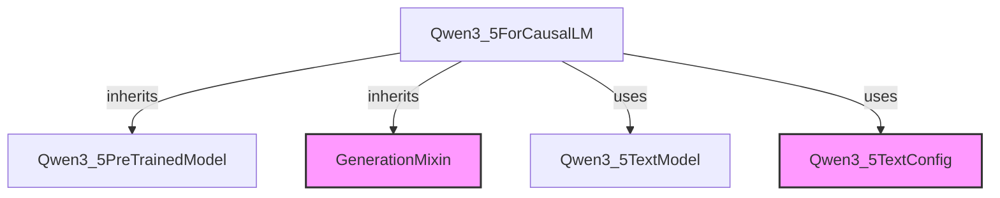

# Module: `qwen3_5_models`

## Introduction
The `qwen3_5_models` module provides the core implementation for the Qwen3.5 causal language model, primarily featuring the `Qwen3_5ForCausalLM` class. This module is designed to facilitate text generation tasks using the Qwen3.5 architecture.

## Architecture and Component Relationships

The `qwen3_5_models` module centers around the `Qwen3_5ForCausalLM` component, which integrates the base Qwen3.5 text model with generation capabilities.

<!-- DIAGRAM_JSON
{
    "direction": "TD",
    "nodes": [
        {"id": "qwen3_5_for_causal_lm", "label": "Qwen3_5ForCausalLM", "type": "component", "link": null},
        {"id": "qwen3_5_text_model", "label": "Qwen3_5TextModel", "type": "component", "link": null},
        {"id": "qwen3_5_pretrained_model", "label": "Qwen3_5PreTrainedModel", "type": "component", "link": null},
        {"id": "generation_mixin", "label": "GenerationMixin", "type": "external", "link": "generation_mixins.md"},
        {"id": "qwen3_5_text_config", "label": "Qwen3_5TextConfig", "type": "external", "link": "qwen3_5_configuration.md"}
    ],
    "edges": [
        {"source": "qwen3_5_for_causal_lm", "target": "qwen3_5_pretrained_model", "label": "inherits"},
        {"source": "qwen3_5_for_causal_lm", "target": "generation_mixin", "label": "inherits"},
        {"source": "qwen3_5_for_causal_lm", "target": "qwen3_5_text_model", "label": "uses"},
        {"source": "qwen3_5_for_causal_lm", "target": "qwen3_5_text_config", "label": "uses"}
    ],
    "groups": []
}
-->

### Core Components

#### `Qwen3_5ForCausalLM`
- **File:** `src/transformers/models/qwen3_5/modeling_qwen3_5.py`
- **Purpose:** This class is the primary interface for using the Qwen3.5 model for causal language modeling tasks. It combines the `Qwen3_5TextModel` (for the core transformer architecture) with the `GenerationMixin` (for text generation utilities).
- **Key Features:**
    - Initializes the `Qwen3_5TextModel` and a linear `lm_head` for vocabulary projection.
    - The `forward` method processes input IDs, attention masks, and other parameters to produce logits and, optionally, compute the causal language modeling loss.
    - Supports caching of past key values for efficient sequential generation.
    - Includes an example demonstrating text generation using the model and tokenizer.
- **Dependencies:**
    - Inherits from `Qwen3_5PreTrainedModel` (internal base model utilities) and [GenerationMixin](generation_mixins.md) (for generation functionalities).
    - Utilizes `Qwen3_5TextModel` for its underlying transformer layers.
    - Relies on `Qwen3_5TextConfig` for model configuration.

### How it Fits into the Overall System

The `qwen3_5_models` module, particularly the `Qwen3_5ForCausalLM` class, serves as a specialized implementation of a large language model within the broader system. It adheres to the standard `transformers` library interface, making it interoperable with other components like tokenizers, trainers, and data pipelines. Its integration with `GenerationMixin` highlights its role in providing robust text generation capabilities, which can be leveraged in various NLP applications. Its dependency on a configuration module (`qwen3_5_configuration.md` assumed) ensures that model parameters are consistently defined and managed.
