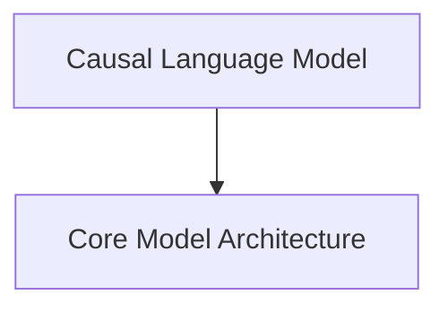

# Qwen3 Next Models Documentation

## Introduction
The `qwen3_next_models` module provides the implementation for the Qwen3Next family of models, focusing on advanced causal language modeling capabilities. This module encompasses the core model architecture and specific implementations for tasks like causal language modeling, designed for high-performance and flexibility.

## Architecture Overview
The Qwen3Next models are structured into a core architectural component and a higher-level causal language model. The core architecture handles the fundamental building blocks, while the causal language model leverages this core for generative tasks, incorporating loss computation and generation utilities.

<!-- DIAGRAM_JSON
{
    "direction": "TD",
    "nodes": [
        {"id": "causal_lm_model", "label": "Causal Language Model", "type": "module", "link": "causal_lm_model.md"},
        {"id": "core_architecture", "label": "Core Model Architecture", "type": "module", "link": "core_architecture.md"}
    ],
    "edges": [
        {"source": "causal_lm_model", "target": "core_architecture"}
    ],
    "groups": []
}
-->

## Sub-modules

### [Causal Language Model](causal_lm_model.md)
This sub-module, primarily implemented by `Qwen3NextForCausalLM`, provides the full causal language modeling capabilities. It includes the logic for forward passes, loss computation (including router auxiliary loss for MoE configurations), and integrates with generation utilities.

### [Core Model Architecture](core_architecture.md)
This sub-module, represented by `Qwen3NextModel`, defines the foundational neural network architecture for the Qwen3Next models. It handles token embeddings, manages the stack of decoder layers (which can incorporate different attention mechanisms like linear attention), and applies normalization. It is the backbone upon which higher-level models are built.