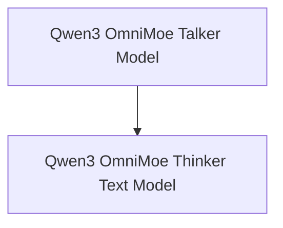

# Qwen3 OmniMoe Models Documentation

## Introduction

The `qwen3_omni_moe_models` module is a crucial component of the Qwen3 OmniMoe architecture, designed to handle multi-modal processing, specifically for audio and text modalities. It encapsulates the core models responsible for generating responses based on different input types, leveraging a Mixture-of-Experts (MoE) approach for efficient and scalable processing.

## Architecture Overview

The module is composed of two primary sub-modules: the `Qwen3OmniMoeTalkerModel` for audio processing and the `Qwen3OmniMoeThinkerTextModel` for text processing. Both models share a common `Qwen3OmniMoePreTrainedModel` base and are designed to integrate with DeepStack visual embeddings, enhancing their multi-modal capabilities.

<!-- DIAGRAM_JSON
{
    "direction": "TD",
    "nodes": [
        {"id": "qwen3_omni_moe_talker_model", "label": "Qwen3 OmniMoe Talker Model", "type": "module", "link": "qwen3_omni_moe_talker_model.md"},
        {"id": "qwen3_omni_moe_thinker_text_model", "label": "Qwen3 OmniMoe Thinker Text Model", "type": "module", "link": "qwen3_omni_moe_thinker_text_model.md"}
    ],
    "edges": [
        {"source": "qwen3_omni_moe_talker_model", "target": "qwen3_omni_moe_thinker_text_model"}
    ],
    "groups": []
}
-->

## Sub-modules

### [Qwen3 OmniMoe Talker Model](qwen3_omni_moe_talker_model.md)
This sub-module is responsible for processing audio input and generating corresponding outputs within the Qwen3 OmniMoe framework. It utilizes a `Qwen3OmniMoeTalkerDecoderLayer` and integrates with DeepStack visual embeddings for enhanced multi-modal understanding.

### [Qwen3 OmniMoe Thinker Text Model](qwen3_omni_moe_thinker_text_model.md)
This sub-module handles the processing of text input and generation of text-based responses. It employs `Qwen3OmniMoeThinkerTextDecoderLayer` and also supports the integration of DeepStack visual embeddings to incorporate visual context into text processing.
