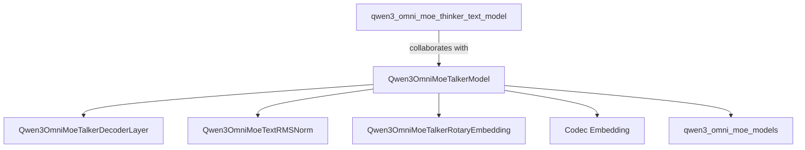

# qwen3_omni_moe_talker_model

The `qwen3_omni_moe_talker_model` module is a core component within the larger Qwen3 Omni Mixture-of-Experts (MoE) framework, specifically designed as the "Talker" model. Its primary responsibility is to process audio inputs and potentially integrate visual information to generate rich outputs. This module represents the generative aspect of a multimodal system, often working in conjunction with a "Thinker" component for comprehensive understanding and response generation.

## Architecture and Core Components

The `Qwen3OmniMoeTalkerModel` is built upon a decoder-only architecture, leveraging a series of `Qwen3OmniMoeTalkerDecoderLayer` instances. It integrates a variety of specialized components for handling audio input, positional embeddings, and optionally, visual information via the DeepStack mechanism.

### Qwen3OmniMoeTalkerModel

This is the main class in the module, inheriting from `Qwen3OmniMoePreTrainedModel`. It orchestrates the entire process of taking audio input (represented by `input_ids` or `inputs_embeds`), applying positional embeddings, passing data through decoder layers, and integrating visual features. Its key characteristics include:

*   **Audio Modality**: Explicitly designed for audio inputs, indicated by `input_modalities = ("audio",)`. The `codec_embedding` layer converts audio codec tokens into hidden states.
*   **Decoder Layers**: A stack of `Qwen3OmniMoeTalkerDecoderLayer` instances, each contributing to the generative process.
*   **Rotary Embeddings**: Utilizes `Qwen3OmniMoeTalkerRotaryEmbedding` to incorporate positional information efficiently.
*   **RMS Normalization**: Employs `Qwen3OmniMoeTextRMSNorm` for normalization within the model.
*   **DeepStack Integration**: A notable feature is the capability to integrate `deepstack_visual_embeds` into the hidden states during the forward pass. This allows the model to leverage visual context, enhancing its multimodal understanding and generation capabilities. The `_deepstack_process` method handles this fusion.
*   **Output Recording**: Configured to record `hidden_states`, `attentions` (from `Qwen3OmniMoeThinkerTextAttention`), and `router_logits` (from `Qwen3OmniMoeTalkerTextTopKRouter`), suggesting a sophisticated monitoring and analysis framework for its internal operations, especially concerning attention and MoE routing decisions.

### `Qwen3OmniMoeTalkerDecoderLayer`

These are the fundamental building blocks of the `Qwen3OmniMoeTalkerModel`'s decoder. Each layer processes the hidden states, likely performing self-attention and feed-forward operations, contributing to the generative sequence. (Further details on its internal structure would be in its own documentation).

### `codec_embedding`

This `nn.Embedding` layer converts discrete audio codec tokens into continuous embedding vectors that the rest of the model can process. It acts as the initial input transformation for audio data.

## Module Relationships

The `qwen3_omni_moe_talker_model` is a specialized component within the broader `qwen3_omni_moe_models` family. It works in tandem with the `qwen3_omni_moe_thinker_text_model`, which likely handles the "thinking" or understanding aspect of multimodal input, while the "Talker" focuses on generating coherent and contextually relevant outputs, primarily from audio and potentially visual inputs.

This module depends on foundational classes and configurations provided by the parent `qwen3_omni_moe_models` module, such as `Qwen3OmniMoePreTrainedModel` and `Qwen3OmniMoeTalkerTextConfig`.

<!-- DIAGRAM_JSON
{
    "direction": "TD",
    "nodes": [
        {"id": "qwen3_omni_moe_talker_model", "label": "Qwen3OmniMoeTalkerModel", "type": "component", "link": null},
        {"id": "qwen3_omni_moe_talker_decoder_layer", "label": "Qwen3OmniMoeTalkerDecoderLayer", "type": "component", "link": null},
        {"id": "qwen3_omni_moe_text_rms_norm", "label": "Qwen3OmniMoeTextRMSNorm", "type": "component", "link": null},
        {"id": "qwen3_omni_moe_talker_rotary_embedding", "label": "Qwen3OmniMoeTalkerRotaryEmbedding", "type": "component", "link": null},
        {"id": "codec_embedding", "label": "Codec Embedding", "type": "component", "link": null},
        {"id": "qwen3_omni_moe_models", "label": "qwen3_omni_moe_models", "type": "external", "link": "qwen3_omni_moe_models.md"},
        {"id": "qwen3_omni_moe_thinker_text_model", "label": "qwen3_omni_moe_thinker_text_model", "type": "external", "link": "qwen3_omni_moe_thinker_text_model.md"}
    ],
    "edges": [
        {"source": "qwen3_omni_moe_talker_model", "target": "qwen3_omni_moe_talker_decoder_layer"},
        {"source": "qwen3_omni_moe_talker_model", "target": "qwen3_omni_moe_text_rms_norm"},
        {"source": "qwen3_omni_moe_talker_model", "target": "qwen3_omni_moe_talker_rotary_embedding"},
        {"source": "qwen3_omni_moe_talker_model", "target": "codec_embedding"},
        {"source": "qwen3_omni_moe_talker_model", "target": "qwen3_omni_moe_models"},
        {"source": "qwen3_omni_moe_thinker_text_model", "target": "qwen3_omni_moe_talker_model", "label": "collaborates with"}
    ],
    "groups": []
}
-->

