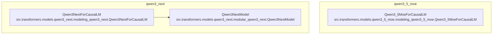

# qwen_models
This module provides Causal Language Model implementations for Qwen 3.5 MoE and Qwen Next architectures, including the core Qwen Next model.

<!-- DIAGRAM_JSON
{
  "nodes": [
    {
      "id": "Qwen3_5MoeForCausalLM",
      "label": "Qwen3_5MoeForCausalLM",
      "path": "src.transformers.models.qwen3_5_moe.modeling_qwen3_5_moe.Qwen3_5MoeForCausalLM",
      "description": "A Causal Language Model for Qwen 3.5 Mixture-of-Experts."
    },
    {
      "id": "Qwen3NextForCausalLM",
      "label": "Qwen3NextForCausalLM",
      "path": "src.transformers.models.qwen3_next.modeling_qwen3_next.Qwen3NextForCausalLM",
      "description": "A Causal Language Model for Qwen Next Mixture-of-Experts."
    },
    {
      "id": "Qwen3NextModel",
      "label": "Qwen3NextModel",
      "path": "src.transformers.models.qwen3_next.modular_qwen3_next.Qwen3NextModel",
      "description": "The core model architecture for Qwen Next, handling token embeddings and decoder layers."
    }
  ],
  "edges": [
    {
      "source": "Qwen3NextForCausalLM",
      "target": "Qwen3NextModel",
      "type": "uses"
    }
  ],
  "groups": [
    {
      "id": "qwen3_5_moe",
      "label": "qwen3_5_moe",
      "members": ["Qwen3_5MoeForCausalLM"]
    },
    {
      "id": "qwen3_next",
      "label": "qwen3_next",
      "members": ["Qwen3NextForCausalLM", "Qwen3NextModel"]
    }
  ]
}
-->
