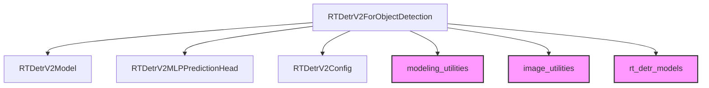

# rt_detr_v2_models Module Documentation

The `rt_detr_v2_models` module provides the core implementation for the RT-DETR-V2 object detection model, an advanced real-time detector. It focuses on encapsulating the model's architecture, initialization, and forward pass logic for object detection tasks. This module is designed to be a central component for deploying and utilizing RT-DETR-V2 models within larger systems.

### Core Functionality

The primary component of this module is `RTDetrV2ForObjectDetection`, which is a specialized model for end-to-end object detection. It integrates the RT-DETR-V2 encoder-decoder architecture with prediction heads for classifying objects and regressing their bounding boxes. 

#### `RTDetrV2ForObjectDetection`

-   **Purpose**: This class is responsible for the complete RT-DETR-V2 object detection pipeline, from processing input pixel values to outputting predicted bounding boxes and class logits. It handles the model's internal structure, including the encoder, decoder, and prediction heads, and manages the forward pass for both training and inference.
-   **Initialization**: The model is initialized with a `RTDetrV2Config` object, which defines architectural parameters such as the model dimension (`d_model`) and the number of decoder layers (`decoder_layers`). It sets up `torch.nn.Linear` layers for class embedding and `RTDetrV2MLPPredictionHead` instances for bounding box prediction across multiple decoder layers.
-   **Forward Pass**: The `forward` method accepts `pixel_values`, `pixel_mask`, and optionally `labels` for training. It propagates the inputs through the `RTDetrV2Model` (encoder-decoder), collects intermediate outputs from the decoder, and applies the class and bounding box prediction heads. During training, it also computes the object detection loss using a dedicated `loss_function`.
-   **Outputs**: The method returns an `RTDetrV2ObjectDetectionOutput` dataclass, containing various model outputs such as `logits`, `pred_boxes`, `loss` (if `labels` are provided), `auxiliary_outputs`, and intermediate hidden states and attentions from both the encoder and decoder.

### Architecture and Component Relationships

The `rt_detr_v2_models` module primarily centers around the `RTDetrV2ForObjectDetection` class. This class integrates several internal components and relies on external utilities for configuration and preprocessing.

<!-- DIAGRAM_JSON
{
    "direction": "TD",
    "nodes": [
        {"id": "rt_detr_v2_for_object_detection", "label": "RTDetrV2ForObjectDetection", "type": "component", "link": null},
        {"id": "rt_detr_v2_model", "label": "RTDetrV2Model", "type": "component", "link": null},
        {"id": "rt_detr_v2_mlpprediction_head", "label": "RTDetrV2MLPPredictionHead", "type": "component", "link": null},
        {"id": "rt_detr_v2_config", "label": "RTDetrV2Config", "type": "component", "link": null},
        {"id": "modeling_utilities", "label": "modeling_utilities", "type": "external", "link": "modeling_utilities.md"},
        {"id": "image_utilities", "label": "image_utilities", "type": "external", "link": "image_utilities.md"},
        {"id": "rt_detr_models", "label": "rt_detr_models", "type": "external", "link": "rt_detr_models.md"}
    ],
    "edges": [
        {"source": "rt_detr_v2_for_object_detection", "target": "rt_detr_v2_model"},
        {"source": "rt_detr_v2_for_object_detection", "target": "rt_detr_v2_mlpprediction_head"},
        {"source": "rt_detr_v2_for_object_detection", "target": "rt_detr_v2_config"},
        {"source": "rt_detr_v2_for_object_detection", "target": "modeling_utilities"},
        {"source": "rt_detr_v2_for_object_detection", "target": "image_utilities"},
        {"source": "rt_detr_v2_for_object_detection", "target": "rt_detr_models"}
    ],
    "groups": []
}
-->

**Internal Components:**
-   `RTDetrV2Model`: This is the backbone encoder-decoder architecture used by `RTDetrV2ForObjectDetection`. It processes the input features to generate intermediate representations.
-   `RTDetrV2MLPPredictionHead`: A multi-layer perceptron (MLP) based prediction head used to regress bounding box coordinates. `RTDetrV2ForObjectDetection` instantiates multiple of these, one for each decoder layer.
-   `RTDetrV2Config`: A configuration object that defines the hyper-parameters and architectural details of the RT-DETR-V2 model.

**External Dependencies:**
-   **[modeling_utilities](modeling_utilities.md)**: Provides foundational utilities and base classes, such as `RTDetrV2PreTrainedModel`, from which `RTDetrV2ForObjectDetection` inherits.
-   **[image_utilities](image_utilities.md)**: Contains utilities for image processing, including `RTDetrV2ImageProcessor`, which is used for preparing images before feeding them to the model and post-processing the model's outputs.
-   **[rt_detr_models](rt_detr_models.md)**: Represents the previous version of the RT-DETR model, indicating a lineage or conceptual dependency where RT-DETR-V2 builds upon its predecessor.

### How the Module Fits into the Overall System

The `rt_detr_v2_models` module serves as a crucial component in any system requiring real-time object detection capabilities. It acts as the primary interface for leveraging the RT-DETR-V2 architecture.

In a typical pipeline:
1.  **Preprocessing**: Input images are processed using utilities from `image_utilities` (e.g., `RTDetrV2ImageProcessor`) to prepare `pixel_values` and `pixel_mask`.
2.  **Model Inference/Training**: The preprocessed inputs are fed into `RTDetrV2ForObjectDetection` for either inference (to get object predictions) or training (to update model weights based on `labels`).
3.  **Post-processing**: The raw outputs (`logits`, `pred_boxes`) from the model are then post-processed (again, often using `image_utilities` or similar) to convert them into human-interpretable bounding box detections and class labels.

This module is designed for high performance and flexibility, making it suitable for integration into various computer vision applications, including autonomous driving, surveillance, and image analysis, where efficient and accurate object detection is paramount.