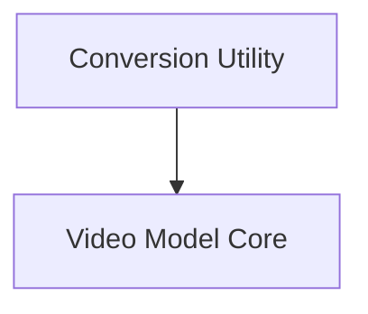

# SAM-2 Video Models Documentation

## Introduction

The `sam2_video_models` module provides the core components for the Segment Anything Model 2 (SAM-2) specifically adapted for video applications. This module facilitates the conversion of pre-trained SAM-2 video checkpoints to the Hugging Face format and encapsulates the main model architecture responsible for various video segmentation tasks, including single-frame inference, memory-conditioned feature processing, and object propagation across video sequences.

## Architecture Overview

The `sam2_video_models` module is structured into key sub-modules that handle distinct aspects of the video segmentation pipeline:

<!-- DIAGRAM_JSON
{
    "direction": "TD",
    "nodes": [
        {"id": "conversion_utility", "label": "Conversion Utility", "type": "module", "link": "conversion_utility.md"},
        {"id": "video_model_core", "label": "Video Model Core", "type": "module", "link": "video_model_core.md"}
    ],
    "edges": [
        {"source": "conversion_utility", "target": "video_model_core"}
    ],
    "groups": []
}
-->

### Sub-modules:

-   **[Conversion Utility](conversion_utility.md)**: This sub-module is responsible for converting SAM-2 video checkpoints into the Hugging Face format. It includes functionalities for loading original checkpoints, adapting them to the Hugging Face architecture, and performing initial verification.

-   **[Video Model Core](video_model_core.md)**: This sub-module contains the primary `Sam2VideoModel` class, which implements the core logic for video segmentation. It encompasses the vision encoder, prompt encoder, mask decoder, and intricate mechanisms for handling temporal information, such as memory attention and memory encoding for propagating objects across video frames.
