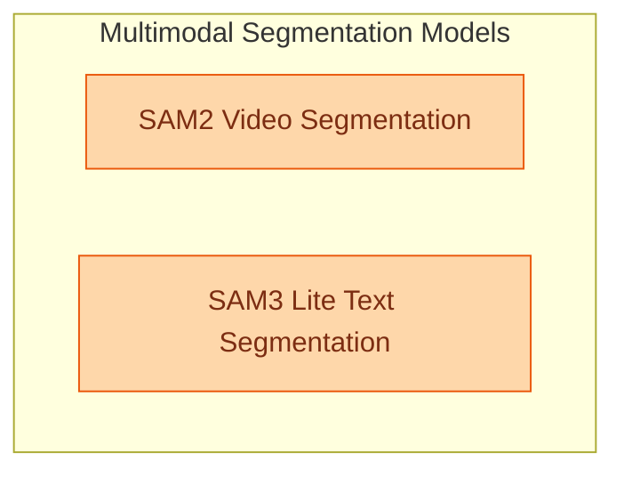

# SAM Multimodal Models
This module encompasses advanced multimodal models like SAM2 for video segmentation and SAM3 Lite for image and text-guided segmentation, providing comprehensive solutions for object detection and mask generation across different data types.

<!-- DIAGRAM_JSON
{
    "direction": "TD",
    "nodes": [
        {"id": "sam2_video_segmentation", "label": "SAM2 Video Segmentation", "type": "module", "link": "sam2_video_segmentation.md"},
        {"id": "sam3_lite_text_segmentation", "label": "SAM3 Lite Text Segmentation", "type": "module", "link": "sam3_lite_text_segmentation.md"}
    ],
    "edges": [],
    "groups": [
        {"id": "segmentation_models", "label": "Multimodal Segmentation Models", "role": "generative", "nodes": ["sam2_video_segmentation", "sam3_lite_text_segmentation"]}
    ]
}
-->
