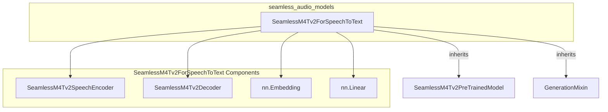

# seamless_audio_models
This module introduces the `SeamlessM4Tv2ForSpeechToText` model, a robust architecture designed for converting audio input directly into text. It utilizes an encoder-decoder framework to achieve high-quality speech recognition.

<!-- DIAGRAM_JSON
{
  "nodes": [
    {"id": "SeamlessM4Tv2ForSpeechToText", "label": "SeamlessM4Tv2ForSpeechToText", "type": "component"},
    {"id": "SeamlessM4Tv2PreTrainedModel", "label": "SeamlessM4Tv2PreTrainedModel", "type": "class"},
    {"id": "GenerationMixin", "label": "GenerationMixin", "type": "class"},
    {"id": "SeamlessM4Tv2SpeechEncoder", "label": "SeamlessM4Tv2SpeechEncoder", "type": "subcomponent"},
    {"id": "SeamlessM4Tv2Decoder", "label": "SeamlessM4Tv2Decoder", "type": "subcomponent"},
    {"id": "nn_Embedding", "label": "nn.Embedding", "type": "subcomponent"},
    {"id": "nn_Linear", "label": "nn.Linear", "type": "subcomponent"}
  ],
  "edges": [
    {"source": "SeamlessM4Tv2ForSpeechToText", "target": "SeamlessM4Tv2PreTrainedModel", "label": "inherits"},
    {"source": "SeamlessM4Tv2ForSpeechToText", "target": "GenerationMixin", "label": "inherits"},
    {"source": "SeamlessM4Tv2ForSpeechToText", "target": "SeamlessM4Tv2SpeechEncoder", "label": "uses (encoder)"},
    {"source": "SeamlessM4Tv2ForSpeechToText", "target": "SeamlessM4Tv2Decoder", "label": "uses (decoder)"},
    {"source": "SeamlessM4Tv2ForSpeechToText", "target": "nn_Embedding", "label": "uses (shared)"},
    {"source": "SeamlessM4Tv2ForSpeechToText", "target": "nn_Linear", "label": "uses (lm_head)"}
  ],
  "groups": [
    {"id": "seamless_audio_models_module", "label": "seamless_audio_models", "nodes": ["SeamlessM4Tv2ForSpeechToText"]},
    {"id": "SeamlessM4Tv2ForSpeechToText_internal", "label": "SeamlessM4Tv2ForSpeechToText", "nodes": ["SeamlessM4Tv2SpeechEncoder", "SeamlessM4Tv2Decoder", "nn_Embedding", "nn_Linear"]}
  ]
}
-->
