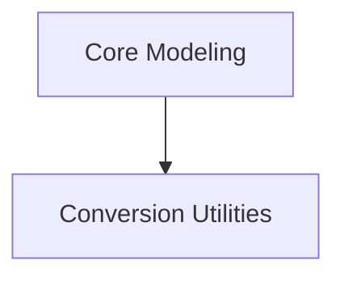

# SeamlessM4T Models Documentation

The `seamless_m4t_models` module provides a comprehensive set of models and utilities for the SeamlessM4T framework, enabling various multimodal tasks such as speech-to-speech, speech-to-text, text-to-speech, and text-to-text translation. It includes core modeling components for these tasks and utilities for converting models from other formats.

## Architecture Overview

This module is structured into two main sub-modules:

<!-- DIAGRAM_JSON
{
    "direction": "TD",
    "nodes": [
        {"id": "conversion_utils", "label": "Conversion Utilities", "type": "module", "link": "conversion_utils.md"},
        {"id": "modeling", "label": "Core Modeling", "type": "module", "link": "modeling.md"}
    ],
    "edges": [
        {"source": "modeling", "target": "conversion_utils"}
    ],
    "groups": []
}
-->

## Sub-modules

### [Core Modeling](modeling.md)

This sub-module contains the primary SeamlessM4T model implementations for different translation directions. It includes classes like `SeamlessM4TForSpeechToSpeech`, `SeamlessM4TForSpeechToText`, `SeamlessM4TForTextToSpeech`, and `SeamlessM4TForTextToText`, providing the neural network architectures for processing and generating various modalities.

### [Conversion Utilities](conversion_utils.md)

The `conversion_utils` sub-module provides functionalities for converting SeamlessM4T models from external frameworks, such as Fairseq2, into the Hugging Face format. This ensures compatibility and ease of use within the Hugging Face ecosystem.