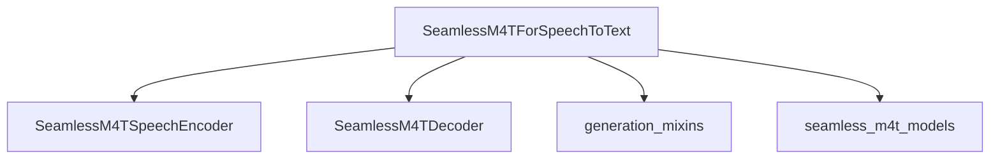

# seamless_m4t_speech_to_text

The `seamless_m4t_speech_to_text` module provides the `SeamlessM4TForSpeechToText` model, which is a core component for performing speech-to-text translation within the SeamlessM4T framework. This model is designed to convert spoken audio directly into textual form, supporting various generation capabilities.

## Architecture and Core Components

The `SeamlessM4TForSpeechToText` model is built upon several key components to facilitate its speech-to-text functionality:

- **SeamlessM4TForSpeechToText**: The main class that orchestrates the speech-to-text process. It utilizes a speech encoder to process incoming audio and a text decoder to generate the output text.
- **SeamlessM4TSpeechEncoder**: Responsible for encoding the input audio features into a rich, context-aware representation. This component is internal to the `seamless_m4t_models`.
- **SeamlessM4TDecoder**: A text decoder that takes the encoded speech representations and generates a sequence of text tokens. This component is also internal to the `seamless_m4t_models`.
- **Shared Embeddings and LM Head**: The model uses a shared embedding layer for token representation and a linear layer (`lm_head`) to predict the next token probabilities, crucial for language modeling.
- **GenerationMixin**: Provides advanced text generation capabilities, allowing for various decoding strategies such as beam search and sampling.

### Diagram

<!-- DIAGRAM_JSON
{
    "direction": "TD",
    "nodes": [
        {"id": "seamless_m4t_speech_to_text_model", "label": "SeamlessM4TForSpeechToText", "type": "component", "link": null},
        {"id": "speech_encoder", "label": "SeamlessM4TSpeechEncoder", "type": "component", "link": "seamless_m4t_models.md"},
        {"id": "text_decoder", "label": "SeamlessM4TDecoder", "type": "component", "link": "seamless_m4t_models.md"},
        {"id": "generation_mixins", "label": "generation_mixins", "type": "external", "link": "generation_mixins.md"},
        {"id": "seamless_m4t_models", "label": "seamless_m4t_models", "type": "external", "link": "seamless_m4t_models.md"}
    ],
    "edges": [
        {"source": "seamless_m4t_speech_to_text_model", "target": "speech_encoder"},
        {"source": "seamless_m4t_speech_to_text_model", "target": "text_decoder"},
        {"source": "seamless_m4t_speech_to_text_model", "target": "generation_mixins"},
        {"source": "seamless_m4t_speech_to_text_model", "target": "seamless_m4t_models"}
    ],
    "groups": []
}
-->


## Module Integration

The `seamless_m4t_speech_to_text` module is a specialized part of the broader [seamless_m4t_models](seamless_m4t_models.md) ecosystem, specifically designed for speech-to-text tasks. It inherits from `SeamlessM4TPreTrainedModel`, gaining common functionalities and ensuring consistency within the SeamlessM4T family. It also utilizes the [generation_mixins](generation_mixins.md) module to provide its text generation capabilities.

## Core Functionality: `SeamlessM4TForSpeechToText`

**`SeamlessM4TForSpeechToText`**

```python
class SeamlessM4TForSpeechToText(SeamlessM4TPreTrainedModel, GenerationMixin):
    input_modalities = "audio"
    _keys_to_ignore_on_load_missing = ["text_encoder", "t2u_model", "vocoder"]
    main_input_name = "input_features"

    _tied_weights_keys = {
        "lm_head.weight": "shared.weight",
        "text_decoder.embed_tokens.weight": "shared.weight",
    }

    def __init__(self, config: SeamlessM4TConfig):
        super().__init__(config)

        self.shared = nn.Embedding(config.vocab_size, config.hidden_size, config.pad_token_id)
        self.speech_encoder = SeamlessM4TSpeechEncoder(config)
        self.text_decoder = SeamlessM4TDecoder(config)
        self.lm_head = nn.Linear(config.hidden_size, config.vocab_size, bias=False)

        # Initialize weights and apply final processing
        self.post_init()

    def forward(
        self,
        input_features: torch.LongTensor | None = None,
        attention_mask: torch.Tensor | None = None,
        decoder_input_ids: torch.LongTensor | None = None,
        labels: torch.LongTensor | None = None,
        **kwargs,
    ) -> Seq2SeqLMOutput | tuple[torch.FloatTensor]:
        # ... (simplified for documentation)
        # Processes audio input_features through speech_encoder and then text_decoder
        # Computes language modeling loss if labels are provided
        # Returns Seq2SeqLMOutput or a tuple of tensors

    def generate(
        self,
        input_features=None,
        tgt_lang=None,
        generation_config=None,
        **kwargs,
    ):
        # ... (simplified for documentation)
        # Generates sequences of token ids from input audio features.
        # Supports specifying a target language (tgt_lang) for translation.
        # Leverages the GenerationMixin for various decoding strategies.

```

### Detailed Functionality

- **`__init__(self, config: SeamlessM4TConfig)`**: Initializes the model with a given configuration. It sets up the shared embeddings, the speech encoder, the text decoder, and the language model head.
- **`forward(...)`**: This method defines the forward pass of the model. It takes audio `input_features`, passes them through the `speech_encoder`, and then uses the output as `encoder_hidden_states` for the `text_decoder`. It can compute a language modeling loss if `labels` are provided.
- **`generate(...)`**: This method, inherited from `GenerationMixin`, enables the generation of text sequences. It takes audio `input_features` and can optionally be guided by a `tgt_lang` to specify the target language for translation. It utilizes the model's configured generation parameters or custom `generation_config` for sequence generation.