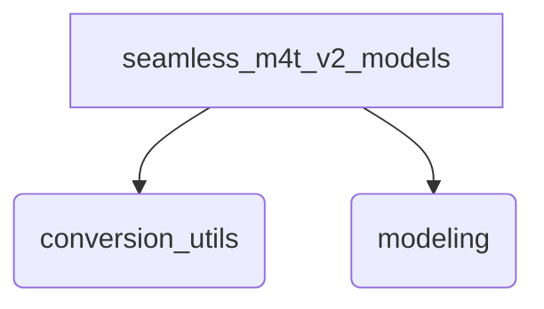
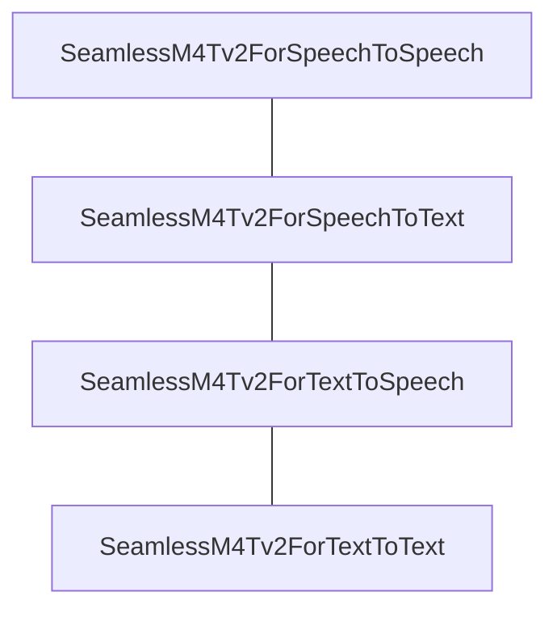

## Overview of `seamless_m4t_v2_models`

### Purpose of the Module

The `seamless_m4t_v2_models` module provides the core implementations and utilities for working with Meta's SeamlessM4Tv2 models within the Hugging Face Transformers library. It is designed to facilitate the conversion of pre-trained SeamlessM4Tv2 checkpoints from their original Fairseq2 format and offers a comprehensive suite of models for various multimodal tasks, including speech-to-speech, speech-to-text, text-to-speech, and text-to-text translation. This module aims to enable seamless integration and deployment of these advanced translation and generation capabilities.

### Architecture of the Module

The `seamless_m4t_v2_models` module is structured into key sub-modules that handle model conversion and task-specific modeling.

#### Top-Level Module Structure



#### `conversion_utils` Sub-module Architecture

The `conversion_utils` sub-module is responsible for converting SeamlessM4Tv2 models from Fairseq2 to the Hugging Face format.

```mermaid
graph TD
    load_model[load_model (Conversion Function)]
    seamlessm4t_tokenizer[SeamlessM4TTokenizer]
    seamlessm4t_feature_extractor[SeamlessM4TFeatureExtractor]
    seamlessm4t_processor[SeamlessM4TProcessor]
    seamlessm4t_model_hf[SeamlessM4TModel (HF)]
    original_translator[Fairseq2 Translator (Original Model)]
    seamless_m4t_models[SeamlessM4T Models Module]
    seamless_m4t_v2_models[SeamlessM4Tv2 Models Module]

    load_model -- initializes from --> original_translator
    load_model -- creates & configures --> seamlessm4t_tokenizer
    load_model -- creates & configures --> seamlessm4t_feature_extractor
    load_model -- creates & pushes --> seamlessm4t_processor
    load_model -- initializes & loads weights --> seamlessm4t_model_hf
    seamlessm4t_processor -- uses --> seamlessm4t_tokenizer
    seamlessm4t_processor -- uses --> seamlessm4t_feature_extractor
    load_model -- supports --> seamless_m4t_models
    load_model -- supports --> seamless_m4t_v2_models

    click load_model "conversion_utils.md" "View load_model function"
    click seamlessm4t_tokenizer "conversion_utils.md" "View SeamlessM4TTokenizer"
    click seamlessm4t_feature_extractor "conversion_utils.md" "View SeamlessM4TFeatureExtractor"
    click seamlessm4t_processor "conversion_utils.md" "View SeamlessM4TProcessor"
    click seamlessm4t_model_hf "modeling_seamless_m4t_v2.md" "View SeamlessM4TModel (HF)"
    click seamless_m4t_models "seamless_m4t_models.md" "View SeamlessM4T Models Module"
    click seamless_m4t_v2_models "seamless_m4t_v2_models.md" "View SeamlessM4Tv2 Models Module"
```

#### `modeling` Sub-module Architecture

The `modeling` sub-module provides the task-specific implementations of SeamlessM4Tv2 models for various multimodal translation and generation tasks.



### References to Core Components Documentation

The `seamless_m4t_v2_models` module and its sub-modules expose the following core components:

*   [`src.transformers.models.seamless_m4t_v2.convert_fairseq2_to_hf.load_model`](conversion_utils.md)
*   [`src.transformers.models.seamless_m4t_v2.modeling_seamless_m4t_v2.SeamlessM4Tv2ForSpeechToSpeech`](modeling_seamless_m4t_v2.md)
*   [`src.transformers.models.seamless_m4t_v2.modeling_seamless_m4t_v2.SeamlessM4Tv2ForSpeechToText`](modeling_seamless_m4t_v2.md)
*   [`src.transformers.models.seamless_m4t_v2.modeling_seamless_m4t_v2.SeamlessM4Tv2ForTextToSpeech`](modeling_seamless_m4t_v2.md)
*   [`src.transformers.models.seamless_m4t_v2.modeling_seamless_m4t_v2.SeamlessM4Tv2ForTextToText`](modeling_seamless_m4t_v2.md)