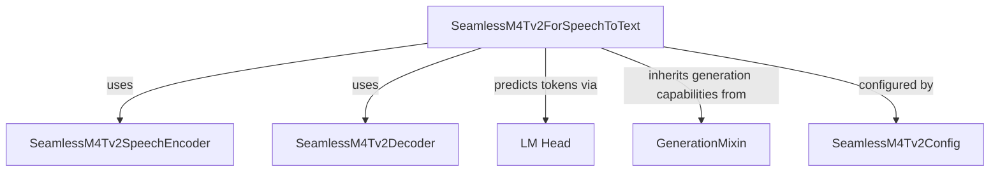

# seamless_m4t_v2_speech_to_text

The `seamless_m4t_v2_speech_to_text` module provides the core functionality for performing speech-to-text translation within the SeamlessM4T v2 framework. It is designed to convert spoken audio input into textual output, leveraging a sophisticated encoder-decoder architecture.

## Purpose and Core Functionality

The primary component of this module is `SeamlessM4Tv2ForSpeechToText`. This class extends `SeamlessM4Tv2PreTrainedModel` and integrates `GenerationMixin` to facilitate both training/inference and advanced text generation capabilities from speech input.

Key functionalities include:
-   **Speech Encoding**: Processing raw audio features into a rich hidden representation.
-   **Text Decoding**: Generating a sequence of text tokens based on the encoded speech representation.
-   **Language Generation**: Utilizing the `generate` method for auto-regressive text generation, allowing specification of target languages.

## Architecture and Component Relationships

The `SeamlessM4Tv2ForSpeechToText` model is built upon an encoder-decoder architecture, specifically designed for speech-to-text tasks. It combines a speech encoder for audio processing and a text decoder for language generation.

**Components:**

*   **`SeamlessM4Tv2ForSpeechToText`**: The central model class that orchestrates the speech-to-text conversion. It initializes and manages the `speech_encoder`, `text_decoder`, and `lm_head` components.
*   **`SeamlessM4Tv2SpeechEncoder`**: (Refer to [seamless_m4t_v2_models.md](seamless_m4t_v2_models.md) for details) This component is responsible for processing the input audio features. It converts the raw speech signal into a sequence of hidden states that capture the phonetic and semantic information of the spoken input.
*   **`SeamlessM4Tv2Decoder`**: (Refer to [seamless_m4t_v2_models.md](seamless_m4t_v2_models.md) for details) This component takes the hidden states from the `speech_encoder` and generates the corresponding text tokens. It's a transformer-based decoder that autoregressively predicts the output sequence.
*   **`lm_head`**: A linear layer that maps the output of the `text_decoder` to the model's vocabulary space, producing logits for each possible output token.
*   **`GenerationMixin`**: (Refer to [generation_mixins.md](generation_mixins.md) for details) This mixin provides common functionalities for text generation, such as beam search, sampling, and managing `generation_config` parameters.
*   **`SeamlessM4Tv2Config`**: (Refer to [seamless_m4t_v2_models.md](seamless_m4t_v2_models.md) for details) This configuration object holds all the hyperparameters and architecture details required to initialize `SeamlessM4Tv2ForSpeechToText`.

## How it Fits into the Overall System

This module is a specialized part of the broader `seamless_m4t_v2_models` ecosystem, which aims to provide a unified model for various multimodal translation tasks. `seamless_m4t_v2_speech_to_text` specifically handles the conversion of speech to text, making it a critical component for applications requiring transcription or cross-lingual speech translation into text.

It interacts with other components within the `seamless_m4t_v2` family, such as feature extractors for preparing audio input and tokenizers for processing text output (though not directly shown as core components here, they are implicitly part of the overall pipeline).

<!-- DIAGRAM_JSON
{
    "direction": "TD",
    "nodes": [
        {"id": "seamless_m4t_v2_speech_to_text", "label": "SeamlessM4Tv2ForSpeechToText", "type": "component", "link": null},
        {"id": "speech_encoder", "label": "SeamlessM4Tv2SpeechEncoder", "type": "external", "link": "seamless_m4t_v2_models.md"},
        {"id": "text_decoder", "label": "SeamlessM4Tv2Decoder", "type": "external", "link": "seamless_m4t_v2_models.md"},
        {"id": "lm_head", "label": "LM Head", "type": "component", "link": null},
        {"id": "generation_mixin", "label": "GenerationMixin", "type": "external", "link": "generation_mixins.md"},
        {"id": "seamless_m4t_v2_config", "label": "SeamlessM4Tv2Config", "type": "external", "link": "seamless_m4t_v2_models.md"}
    ],
    "edges": [
        {"source": "seamless_m4t_v2_speech_to_text", "target": "speech_encoder"},
        {"source": "seamless_m4t_v2_speech_to_text", "target": "text_decoder"},
        {"source": "seamless_m4t_v2_speech_to_text", "target": "lm_head"},
        {"source": "seamless_m4t_v2_speech_to_text", "target": "generation_mixin"},
        {"source": "seamless_m4t_v2_speech_to_text", "target": "seamless_m4t_v2_config"}
    ],
    "groups": []
}
-->