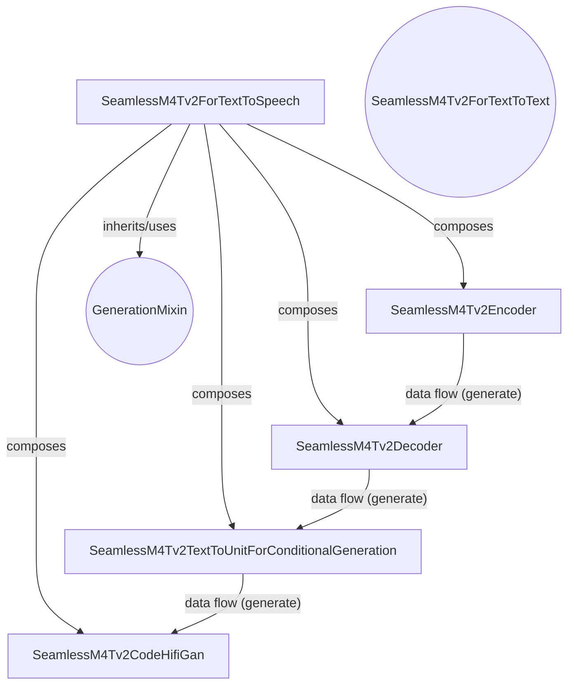

# SeamlessM4Tv2 Text-to-Speech Module

This document provides comprehensive documentation for the `seamless_m4t_v2_text_to_speech` module, which is responsible for generating audio waveforms from text input using the SeamlessM4Tv2 model.

<!-- DIAGRAM_JSON
{
    "direction": "TD",
    "nodes": [
        {"id": "seamless_m4t_v2_tts", "label": "SeamlessM4Tv2ForTextToSpeech", "type": "component", "link": null},
        {"id": "text_encoder", "label": "SeamlessM4Tv2Encoder", "type": "component", "link": null},
        {"id": "text_decoder", "label": "SeamlessM4Tv2Decoder", "type": "component", "link": null},
        {"id": "t2u_model", "label": "SeamlessM4Tv2TextToUnitForConditionalGeneration", "type": "component", "link": null},
        {"id": "vocoder", "label": "SeamlessM4Tv2CodeHifiGan", "type": "component", "link": null},
        {"id": "generation_mixin", "label": "GenerationMixin", "type": "external", "link": "generation_mixins.md"},
        {"id": "seamless_m4t_v2_text_to_text", "label": "SeamlessM4Tv2ForTextToText", "type": "external", "link": "seamless_m4t_v2_text_to_text.md"}
    ],
    "edges": [
        {"source": "seamless_m4t_v2_tts", "target": "generation_mixin", "label": "inherits/uses"},
        {"source": "seamless_m4t_v2_tts", "target": "text_encoder", "label": "composes"},
        {"source": "seamless_m4t_v2_tts", "target": "text_decoder", "label": "composes"},
        {"source": "seamless_m4t_v2_tts", "target": "t2u_model", "label": "composes"},
        {"source": "seamless_m4t_v2_tts", "target": "vocoder", "label": "composes"},
        {"source": "text_encoder", "target": "text_decoder", "label": "data flow (generate)"},
        {"source": "text_decoder", "target": "t2u_model", "label": "data flow (generate)"},
        {"source": "t2u_model", "target": "vocoder", "label": "data flow (generate)"}
    ],
    "groups": []
}
-->

## 1. Purpose and Core Functionality

The `seamless_m4t_v2_text_to_speech` module provides the Text-to-Speech (TTS) capabilities for the SeamlessM4Tv2 model. Its primary function is to convert textual input into spoken audio waveforms across various target languages. This module orchestrates a multi-stage generation process, including text encoding, text decoding (for intermediate representation), text-to-unit conversion, and finally, vocoder synthesis.

The core component, `SeamlessM4Tv2ForTextToSpeech`, combines several sub-models to achieve this:

*   **Text Encoding:** Transforms the input text into a rich hidden representation.
*   **Text Decoding:** Processes the encoded text and generates an intermediate sequence of text tokens, effectively performing a text-to-text translation if a target language is specified.
*   **Text-to-Unit (T2U) Conversion:** Converts the generated text tokens into discrete audio units.
*   **Vocoder Synthesis:** Converts these discrete audio units into a continuous audio waveform.

While the `forward` method allows for standard encoder-decoder operations (primarily for training the text-to-text part with masked language modeling loss), the dedicated `generate` method encapsulates the complete text-to-speech pipeline, ensuring a seamless conversion from text to audio.

## 2. Architecture and Component Relationships

The `SeamlessM4Tv2ForTextToSpeech` class is built upon a modular architecture, integrating several specialized components:

*   **`SeamlessM4Tv2ForTextToSpeech`**: The main class, inheriting from `SeamlessM4Tv2PreTrainedModel` and utilizing the [generation_mixins](generation_mixins.md#generationmixin) for its generation capabilities. It composes and coordinates the following sub-components.
    *   **`self.shared` (`nn.Embedding`):** A shared embedding layer used by both the text encoder and decoder, promoting consistency and reducing redundancy.
    *   **`self.text_encoder` (`SeamlessM4Tv2Encoder`):** Responsible for processing the initial text input and generating contextualized embeddings. This component is part of the initial text processing stage.
    *   **`self.text_decoder` (`SeamlessM4Tv2Decoder`):** Takes the output from the `text_encoder` and generates a sequence of output text tokens. This step is conceptually similar to the text generation process found in the [seamless_m4t_v2_text_to_text](seamless_m4t_v2_text_to_text.md) module, acting as an intermediate step before unit conversion.
    *   **`self.lm_head` (`nn.Linear`):** A linear layer used for the language modeling head, primarily for computing losses during training of the text-to-text components.
    *   **`self.t2u_model` (`SeamlessM4Tv2TextToUnitForConditionalGeneration`):** A critical component that translates the decoded text tokens into a sequence of discrete audio units. This model bridges the gap between linguistic and acoustic representations.
    *   **`self.vocoder` (`SeamlessM4Tv2CodeHifiGan`):** The final stage in the TTS pipeline, responsible for synthesizing a high-fidelity audio waveform from the discrete audio units provided by the `t2u_model`.

The `generate` method orchestrates the data flow:

1.  Initial text processing (potentially including translation) is handled by leveraging the `GenerationMixin`'s `generate` method, which internally uses `self.text_encoder` and `self.text_decoder` to produce a sequence of translated text tokens and encoder hidden states.
2.  These translated text tokens are then fed into the `self.t2u_model` to generate discrete audio units.
3.  Finally, the `self.vocoder` takes these audio units and synthesizes the final audio waveform.

## 3. How the Module Fits into the Overall System

The `seamless_m4t_v2_text_to_speech` module is a core part of the `bart_models.modeling` sub-system, specifically designed for multimodal tasks within the SeamlessM4Tv2 framework. It is closely related to other `seamless_m4t_v2` modeling components, particularly:

*   **[seamless_m4t_v2_text_to_text](seamless_m4t_v2_text_to_text.md):** The text encoding and decoding steps within `SeamlessM4Tv2ForTextToSpeech` share a significant architectural overlap with the text-to-text translation capabilities, leveraging common encoder and decoder structures. The `forward` method of `SeamlessM4Tv2ForTextToSpeech` explicitly notes its similarity to `SeamlessM4Tv2ForTextToText`.
*   **[seamless_m4t_v2_speech_to_text](seamless_m4t_v2_speech_to_text.md) and [seamless_m4t_v2_speech_to_speech](seamless_m4t_v2_speech_to_speech.md):** While `seamless_m4t_v2_text_to_speech` focuses on generating speech from text, the broader SeamlessM4Tv2 framework aims for universal language translation, encompassing speech-to-text and speech-to-speech functionalities. This module complements those by completing the text-to-speech leg of the multimodal translation capabilities.

This module plays a vital role in enabling the SeamlessM4Tv2 model to output spoken language, making it a crucial component for applications requiring audio synthesis from textual input. It leverages the robust text processing capabilities of the overall SeamlessM4Tv2 architecture and extends them with specialized audio generation components.