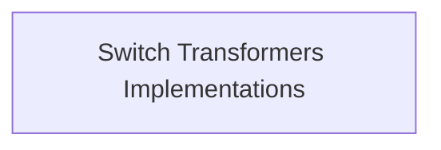

# `seq2seq_models` Module Documentation

## Introduction

The `seq2seq_models` module, specifically within the `switch_transformers` context, provides implementations for Switch Transformers models tailored for sequence-to-sequence tasks. This module leverages the Mixture-of-Experts (MoE) architecture to enhance model capacity and efficiency. It includes foundational components for building Switch Transformers and a specialized model for conditional generation.

## Architecture Overview

The `seq2seq_models` module primarily consists of core Switch Transformer implementations that form the backbone for various sequence-to-sequence modeling tasks. The architecture revolves around an encoder-decoder structure, with an emphasis on the Mixture-of-Experts (MoE) paradigm for efficient scaling.

<!-- DIAGRAM_JSON
{
    "direction": "TD",
    "nodes": [
        {"id": "switch_transformers_implementations", "label": "Switch Transformers Implementations", "type": "module", "link": "switch_transformers_implementations.md"}
    ],
    "edges": [],
    "groups": []
}
-->

## Sub-modules

### [Switch Transformers Implementations](switch_transformers_implementations.md)

This sub-module contains the core `SwitchTransformersModel` and `SwitchTransformersForConditionalGeneration` classes. The `SwitchTransformersModel` provides the basic encoder-decoder architecture, while `SwitchTransformersForConditionalGeneration` extends this with a language model head and functionalities for conditional text generation, incorporating router loss calculations essential for the MoE architecture.
