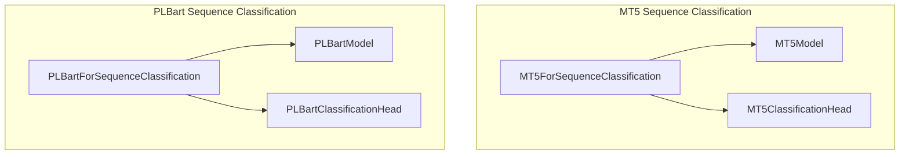

# sequence_classification
This module provides classes for sequence classification tasks, specifically implementing `MT5ForSequenceClassification` and `PLBartForSequenceClassification` by integrating their respective base models with a classification head.

<!-- DIAGRAM_JSON
{
  "nodes": [
    {
      "id": "MT5ForSequenceClassification",
      "label": "MT5ForSequenceClassification",
      "class": "component"
    },
    {
      "id": "PLBartForSequenceClassification",
      "label": "PLBartForSequenceClassification",
      "class": "component"
    },
    {
      "id": "MT5Model",
      "label": "MT5Model",
      "class": "dependency"
    },
    {
      "id": "MT5ClassificationHead",
      "label": "MT5ClassificationHead",
      "class": "dependency"
    },
    {
      "id": "PLBartModel",
      "label": "PLBartModel",
      "class": "dependency"
    },
    {
      "id": "PLBartClassificationHead",
      "label": "PLBartClassificationHead",
      "class": "dependency"
    }
  ],
  "edges": [
    {
      "source": "MT5ForSequenceClassification",
      "target": "MT5Model",
      "label": "uses"
    },
    {
      "source": "MT5ForSequenceClassification",
      "target": "MT5ClassificationHead",
      "label": "uses"
    },
    {
      "source": "PLBartForSequenceClassification",
      "target": "PLBartModel",
      "label": "uses"
    },
    {
      "source": "PLBartForSequenceClassification",
      "target": "PLBartClassificationHead",
      "label": "uses"
    }
  ],
  "groups": [
    {
      "id": "MT5Group",
      "label": "MT5 Sequence Classification",
      "nodes": ["MT5ForSequenceClassification", "MT5Model", "MT5ClassificationHead"]
    },
    {
      "id": "PLBartGroup",
      "label": "PLBart Sequence Classification",
      "nodes": ["PLBartForSequenceClassification", "PLBartModel", "PLBartClassificationHead"]
    }
  ]
}
-->
