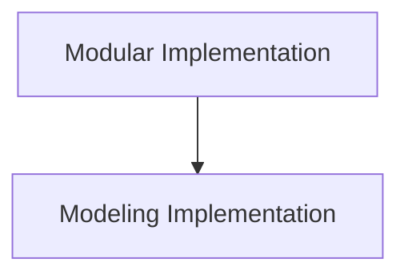

# Sequence Classification Models

The `sequence_classification_models` module provides implementations for sequence classification tasks using the Zamba2 model architecture. It offers both a direct modeling implementation and a modular approach to extend its capabilities.

## Architecture Overview

The sequence classification models in Zamba2 are structured around a core Zamba2 model, with distinct implementations for standard modeling and modular extensions. Below is a high-level overview of the module's architecture:

<!-- DIAGRAM_JSON
{
    "direction": "TD",
    "nodes": [
        {"id": "modeling_implementation", "label": "Modeling Implementation", "type": "module", "link": "modeling_implementation.md"},
        {"id": "modular_implementation", "label": "Modular Implementation", "type": "module", "link": "modular_implementation.md"}
    ],
    "edges": [
        {"source": "modular_implementation", "target": "modeling_implementation"}
    ],
    "groups": []
}
-->

## Sub-modules

### [Modeling Implementation](modeling_implementation.md)
This sub-module contains the primary implementation of `Zamba2ForSequenceClassification`, handling the core logic for sequence classification based on the Zamba2 model. It integrates with the base Zamba2 model and provides the forward pass for computing classification logits and loss.

### [Modular Implementation](modular_implementation.md)
This sub-module offers a flexible and modular `Zamba2ForSequenceClassification` implementation. It extends the base sequence classification functionality, allowing for potential customization or integration with other modular components of the Zamba2 architecture. It inherits from `ZambaForSequenceClassification` and uses `Zamba2Model` internally.
