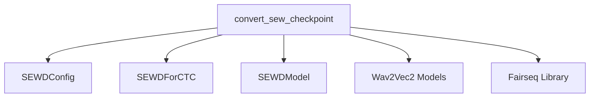

# SEW-D Models Module Documentation

## Introduction

The `sew_d_models` module is responsible for providing the implementation and utilities related to the Self-Supervised-EM-Weakly-Supervised-D (SEW-D) models. Its primary function is to facilitate the conversion of original Fairseq SEW-D model checkpoints into the Hugging Face Transformers format, ensuring compatibility and ease of use within the Transformers ecosystem.

## Core Functionality

The core functionality of this module revolves around the `convert_sew_checkpoint` function, which enables the seamless migration of pre-trained or fine-tuned SEW-D models from Fairseq to Hugging Face.

### `convert_sew_checkpoint`

**Component ID:** `src.transformers.models.sew_d.convert_sew_d_original_pytorch_checkpoint_to_pytorch.convert_sew_checkpoint`

This function is designed to take a Fairseq SEW-D model checkpoint and convert its weights and configuration into the Hugging Face Transformers format. It handles both pre-trained (self-supervised) and fine-tuned models, adapting the necessary components such as the feature extractor and tokenizer based on whether the model is fine-tuned for a specific task like Automatic Speech Recognition (ASR).

**Key Features:**

*   **Checkpoint Loading:** Loads Fairseq model ensembles and tasks from the provided checkpoint path.
*   **Configuration Conversion:** Converts the Fairseq model configuration into a `SEWDConfig` object, which is then used to initialize the Hugging Face `SEWDModel` or `SEWDForCTC`.
*   **Feature Extractor Initialization:** Initializes a `Wav2Vec2FeatureExtractor` to preprocess audio inputs, adjusting `return_attention_mask` based on the model's normalization strategy.
*   **Tokenizer Handling (Finetuned Models):** For fine-tuned models, it loads a target dictionary (`dict_path`), adjusts token IDs (BOS, PAD) for CTC compatibility, and creates a `Wav2Vec2CTCTokenizer`. This tokenizer, along with the feature extractor, forms a `Wav2Vec2Processor`.
*   **Model Initialization:** Instantiates either `SEWDForCTC` (for fine-tuned models) or `SEWDModel` (for pre-trained models) based on the `is_finetuned` flag.
*   **Weight Loading:** Recursively copies and adjusts the weights from the Fairseq model to the Hugging Face model.
*   **Saving:** Saves the converted Hugging Face model and the associated processor/feature extractor to the specified output directory.

## Architecture and Component Relationships

The `sew_d_models` module, through its conversion utility, interacts with external libraries and other internal Transformers modules to achieve its functionality.

<!-- DIAGRAM_JSON
{
    "direction": "TD",
    "nodes": [
        {"id": "convert_sew_checkpoint", "label": "convert_sew_checkpoint", "type": "component", "link": null},
        {"id": "sewd_config", "label": "SEWDConfig", "type": "component", "link": null},
        {"id": "sewd_for_ctc", "label": "SEWDForCTC", "type": "component", "link": null},
        {"id": "sewd_model", "label": "SEWDModel", "type": "component", "link": null},
        {"id": "wav2vec2_models", "label": "Wav2Vec2 Models", "type": "external", "link": "wav2vec2_models.md"},
        {"id": "fairseq_lib", "label": "Fairseq Library", "type": "external", "link": null}
    ],
    "edges": [
        {"source": "convert_sew_checkpoint", "target": "sewd_config"},
        {"source": "convert_sew_checkpoint", "target": "sewd_for_ctc"},
        {"source": "convert_sew_checkpoint", "target": "sewd_model"},
        {"source": "convert_sew_checkpoint", "target": "wav2vec2_models"},
        {"source": "convert_sew_checkpoint", "target": "fairseq_lib"}
    ],
    "groups": []
}
-->

## How the Module Fits into the Overall System

The `sew_d_models` module serves as a crucial bridge for integrating SEW-D models, originally developed using Fairseq, into the Hugging Face Transformers ecosystem. By providing a dedicated conversion utility, it allows researchers and developers to leverage the powerful and flexible tools available in Transformers for fine-tuning, inference, and deployment of SEW-D models, without needing to maintain separate Fairseq environments. This integration enhances interoperability and broadens the accessibility of SEW-D models to a wider community.

It depends on the [wav2vec2_models](wav2vec2_models.md) for its feature extraction and tokenization capabilities, as the SEW-D models share processing methodologies with Wav2Vec2. This dependency streamlines the data handling pipeline for audio-based tasks. The module is primarily utilized during the initial setup and migration phase of SEW-D models.