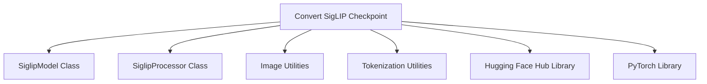

# SigLIP Models Documentation

## Introduction

The `siglip_models` module is responsible for facilitating the integration of SigLIP models into the Hugging Face ecosystem. Its primary function is to convert original SigLIP model checkpoints into a format compatible with Hugging Face's `transformers` library, including handling model weights, configuration, and creating appropriate processors for inference.

This module is crucial for enabling the use of pre-trained SigLIP models within the broader Hugging Face framework, allowing users to leverage their powerful image-text understanding capabilities with ease.

<!-- DIAGRAM_JSON
{
    "direction": "TD",
    "nodes": [
        {"id": "convert_siglip_checkpoint", "label": "Convert SigLIP Checkpoint", "type": "component", "link": null},
        {"id": "siglip_model_class", "label": "SiglipModel Class", "type": "external", "link": null},
        {"id": "siglip_processor_class", "label": "SiglipProcessor Class", "type": "external", "link": null},
        {"id": "image_utilities", "label": "Image Utilities", "type": "external", "link": "image_utilities.md"},
        {"id": "tokenization_utilities", "label": "Tokenization Utilities", "type": "external", "link": "tokenization_utilities.md"},
        {"id": "huggingface_hub_library", "label": "Hugging Face Hub Library", "type": "external", "link": null},
        {"id": "pytorch_library", "label": "PyTorch Library", "type": "external", "link": null}
    ],
    "edges": [
        {"source": "convert_siglip_checkpoint", "target": "siglip_model_class"},
        {"source": "convert_siglip_checkpoint", "target": "siglip_processor_class"},
        {"source": "convert_siglip_checkpoint", "target": "image_utilities"},
        {"source": "convert_siglip_checkpoint", "target": "tokenization_utilities"},
        {"source": "convert_siglip_checkpoint", "target": "huggingface_hub_library"},
        {"source": "convert_siglip_checkpoint", "target": "pytorch_library"}
    ],
    "groups": []
}
-->

## Module Architecture

The `siglip_models` module, as a leaf module, centers around its core function, `convert_siglip_checkpoint`. This function orchestrates the entire conversion process, interacting with various internal helper functions and external libraries to achieve its goal.

### Component: `convert_siglip_checkpoint`

- **File**: `src/transformers/models/siglip/convert_siglip_to_hf.py`
- **Purpose**: This function takes an original SigLIP model name, downloads its checkpoint if necessary, converts its weights to the Hugging Face `SiglipModel` format, and creates a corresponding `SiglipProcessor`. It also includes a verification step to ensure the converted model produces expected logits on dummy data.

- **Process Overview**:
    1.  **Configuration Retrieval**: Fetches the appropriate `SiglipConfig` based on the provided `model_name`.
    2.  **Checkpoint Loading**: Downloads the model checkpoint from the Hugging Face Hub if not available locally, then loads and flattens its state dictionary.
    3.  **Weight Transformation**: Renames and transforms keys in the state dictionary to match the `SiglipModel`'s architecture. Special handling is applied to QKV matrices in the attention pooling head.
    4.  **Model Instantiation**: Initializes a `SiglipModel` with the obtained configuration and loads the transformed state dictionary.
    5.  **Processor Creation**: Constructs a `SiglipProcessor` by combining an `image_processor` (obtained via [image_utilities](image_utilities.md)) and a `tokenizer` (obtained via [tokenization_utilities](tokenization_utilities.md)).
    6.  **Verification (Optional)**: Performs a forward pass with dummy images and texts, and compares the output logits against expected values to ensure conversion correctness.
    7.  **Saving and Pushing (Optional)**: Saves the converted model and processor to a specified local path and optionally pushes them to the Hugging Face Hub.

- **Parameters**:
    - `model_name` (`str`): The name of the SigLIP model to convert (e.g., "siglip-base-patch16-224").
    - `pytorch_dump_folder_path` (`str`, *optional*): The path where the converted Hugging Face model and processor will be saved locally. If `None`, no local saving occurs.
    - `verify_logits` (`bool`, *default*: `True`): If `True`, performs a verification step by running a forward pass and checking logits against expected values.
    - `push_to_hub` (`bool`, *default*: `False`): If `True`, the converted model and processor will be pushed to the Hugging Face Hub.

- **Dependencies**:
    - **Internal Helper Functions**: `get_siglip_config`, `model_name_to_checkpoint`, `flatten_nested_dict`, `split_encoderblock_layers`, `create_rename_keys`, `rename_key`, `read_in_q_k_v_head`, `get_image_processor`, `get_tokenizer`.
    - **Hugging Face Libraries**: `SiglipModel`, `SiglipProcessor`, `hf_hub_download`, `push_to_hub`.
    - **External Libraries**: `os` (for file system operations), `torch` (for tensor operations and model loading), `httpx` (for image download), `PIL.Image` (for image processing), `io.BytesIO` (for handling image data).