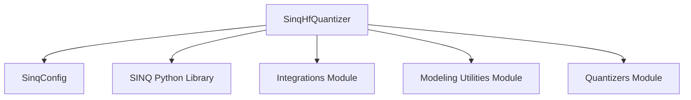

# SINQ Quantizer Module

## Introduction

The `sinq_quantizer` module provides the core functionality for integrating SINQ (Sparse INT8 Quantization) within the Hugging Face Transformers library. It primarily features the `SinqHfQuantizer` class, which manages the quantization process for models, enabling efficient deployment with reduced memory footprint and improved inference speed. This module supports weight-only SINQ quantization and offers mechanisms to handle models that are already pre-quantized.

## Architecture and Component Relationships

At the heart of the `sinq_quantizer` module is the `SinqHfQuantizer` class. This class inherits from `HfQuantizer` (from the [quantizers module](quantizers.md)) and orchestrates the various steps involved in SINQ quantization. It uses a `SinqConfig` object to define the quantization parameters, such as the number of bits and group size.

During the model loading process, `SinqHfQuantizer` dynamically replaces standard `torch.nn.Linear` layers with `SINQLinear` modules, which are specialized quantized linear layers provided by the external SINQ Python library. It also leverages helper functions and conversion operations from the [integrations module](integrations.md), specifically `SinqQuantize` for parameter-level quantization and `SinqDeserialize` for handling pre-quantized weights. Furthermore, it patches the Hugging Face model's save and load methods to ensure proper serialization of SINQ-quantized models.

<!-- DIAGRAM_JSON
{
    "direction": "TD",
    "nodes": [
        {"id": "sinq_hf_quantizer", "label": "SinqHfQuantizer", "type": "component", "link": null},
        {"id": "sinq_config", "label": "SinqConfig", "type": "component", "link": null},
        {"id": "sinq_lib", "label": "SINQ Python Library", "type": "external", "link": null},
        {"id": "quantizers_module", "label": "Quantizers Module", "type": "external", "link": "quantizers.md"},
        {"id": "integrations_module", "label": "Integrations Module", "type": "external", "link": "integrations.md"},
        {"id": "modeling_utilities", "label": "Modeling Utilities Module", "type": "external", "link": "modeling_utilities.md"}
    ],
    "edges": [
        {"source": "sinq_hf_quantizer", "target": "sinq_config"},
        {"source": "sinq_hf_quantizer", "target": "sinq_lib"},
        {"source": "sinq_hf_quantizer", "target": "integrations_module"},
        {"source": "sinq_hf_quantizer", "target": "modeling_utilities"},
        {"source": "sinq_hf_quantizer", "target": "quantizers_module"}
    ],
    "groups": []
}
-->

## How the Module Fits into the Overall System

The `sinq_quantizer` module is a specialized component within the broader [quantizers module](quantizers.md), specifically nested under [other_quantization_methods](other_quantization_methods.md). Its role is to provide a dedicated implementation for SINQ, a specific quantization scheme, alongside other quantization methods like BitNet and Quark. By adhering to the `HfQuantizer` interface, it seamlessly integrates into the Hugging Face ecosystem, allowing users to apply SINQ quantization to various `PreTrainedModel` instances. This modular design ensures that different quantization techniques can be swapped in and out, providing flexibility for optimizing models for deployment while maintaining compatibility with the larger Transformers framework.