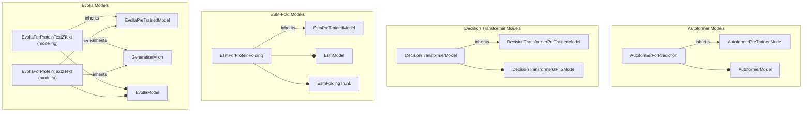

# specialized_model_architectures
This module defines specialized model architectures for various tasks, including time series prediction, offline reinforcement learning, protein folding, and protein-text interaction, leveraging pre-trained models and generation capabilities.

<!-- DIAGRAM_JSON
{
  "nodes": [
    {"id": "AutoformerForPrediction", "label": "AutoformerForPrediction"},
    {"id": "AutoformerPreTrainedModel", "label": "AutoformerPreTrainedModel"},
    {"id": "AutoformerModel", "label": "AutoformerModel"},
    {"id": "DecisionTransformerModel", "label": "DecisionTransformerModel"},
    {"id": "DecisionTransformerPreTrainedModel", "label": "DecisionTransformerPreTrainedModel"},
    {"id": "DecisionTransformerGPT2Model", "label": "DecisionTransformerGPT2Model"},
    {"id": "EsmForProteinFolding", "label": "EsmForProteinFolding"},
    {"id": "EsmPreTrainedModel", "label": "EsmPreTrainedModel"},
    {"id": "EsmModel", "label": "EsmModel"},
    {"id": "EsmFoldingTrunk", "label": "EsmFoldingTrunk"},
    {"id": "EvollaForProteinText2Text_Modeling", "label": "EvollaForProteinText2Text (modeling)"},
    {"id": "EvollaForProteinText2Text_Modular", "label": "EvollaForProteinText2Text (modular)"},
    {"id": "EvollaPreTrainedModel", "label": "EvollaPreTrainedModel"},
    {"id": "GenerationMixin", "label": "GenerationMixin"},
    {"id": "EvollaModel", "label": "EvollaModel"}
  ],
  "edges": [
    {"source": "AutoformerForPrediction", "target": "AutoformerPreTrainedModel", "type": "inheritance"},
    {"source": "AutoformerForPrediction", "target": "AutoformerModel", "type": "composition"},
    {"source": "DecisionTransformerModel", "target": "DecisionTransformerPreTrainedModel", "type": "inheritance"},
    {"source": "DecisionTransformerModel", "target": "DecisionTransformerGPT2Model", "type": "composition"},
    {"source": "EsmForProteinFolding", "target": "EsmPreTrainedModel", "type": "inheritance"},
    {"source": "EsmForProteinFolding", "target": "EsmModel", "type": "composition"},
    {"source": "EsmForProteinFolding", "target": "EsmFoldingTrunk", "type": "composition"},
    {"source": "EvollaForProteinText2Text_Modeling", "target": "EvollaPreTrainedModel", "type": "inheritance"},
    {"source": "EvollaForProteinText2Text_Modeling", "target": "GenerationMixin", "type": "inheritance"},
    {"source": "EvollaForProteinText2Text_Modeling", "target": "EvollaModel", "type": "composition"},
    {"source": "EvollaForProteinText2Text_Modular", "target": "EvollaPreTrainedModel", "type": "inheritance"},
    {"source": "EvollaForProteinText2Text_Modular", "target": "GenerationMixin", "type": "inheritance"},
    {"source": "EvollaForProteinText2Text_Modular", "target": "EvollaModel", "type": "composition"}
  ],
  "groups": [
    {"id": "Autoformer", "label": "Autoformer Models", "nodes": ["AutoformerForPrediction", "AutoformerPreTrainedModel", "AutoformerModel"]},
    {"id": "DecisionTransformer", "label": "Decision Transformer Models", "nodes": ["DecisionTransformerModel", "DecisionTransformerPreTrainedModel", "DecisionTransformerGPT2Model"]},
    {"id": "ESMFold", "label": "ESM-Fold Models", "nodes": ["EsmForProteinFolding", "EsmPreTrainedModel", "EsmModel", "EsmFoldingTrunk"]},
    {"id": "Evolla", "label": "Evolla Models", "nodes": ["EvollaForProteinText2Text_Modeling", "EvollaForProteinText2Text_Modular", "EvollaPreTrainedModel", "GenerationMixin", "EvollaModel"]}
  ]
}
-->
