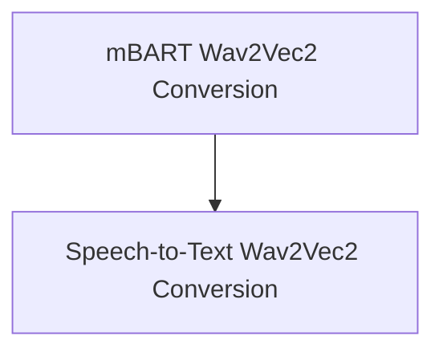

# Speech Encoder Decoder Models

This module provides utilities for converting pre-trained speech encoder-decoder models from their original formats to the Hugging Face Transformers compatible format. It specifically focuses on models that combine a Wav2Vec2 encoder with either an mBART or Speech2Text2 decoder, facilitating seamless integration and further fine-tuning within the Transformers ecosystem.

## Architecture Overview

The `speech_encoder_decoder_models` module is composed of two primary sub-modules, each responsible for a specific type of model conversion. These sub-modules encapsulate the logic required to load original model checkpoints, adapt their weights, and save them in a standardized format. The overall architecture is designed to be modular, allowing for easy expansion to support other speech encoder-decoder architectures in the future.

<!-- DIAGRAM_JSON
{
    "direction": "TD",
    "nodes": [
        {"id": "mbart_wav2vec2_conversion", "label": "mBART Wav2Vec2 Conversion", "type": "module", "link": "mbart_wav2vec2_conversion.md"},
        {"id": "speech_to_text_wav2vec2_conversion", "label": "Speech-to-Text Wav2Vec2 Conversion", "type": "module", "link": "speech_to_text_wav2vec2_conversion.md"}
    ],
    "edges": [
        {"source": "mbart_wav2vec2_conversion", "target": "speech_to_text_wav2vec2_conversion"}
    ],
    "groups": []
}
-->

## Sub-modules

### [mBART Wav2Vec2 Conversion](mbart_wav2vec2_conversion.md)
This sub-module focuses on converting original mBART-Wav2Vec2 sequence-to-sequence model checkpoints. It leverages Fairseq utilities to load the original model and then meticulously transfers the encoder (Wav2Vec2) and decoder (mBART) weights to their respective Hugging Face Transformers counterparts, ensuring proper configuration and tokenization setup.

### [Speech-to-Text Wav2Vec2 Conversion](speech_to_text_wav2vec2_conversion.md)
This sub-module is dedicated to converting original Speech-to-Text Wav2Vec2 model checkpoints. Similar to the mBART conversion, it uses Fairseq for loading and then carefully maps the Wav2Vec2 encoder and Speech2Text2 decoder weights to the Hugging Face Transformers model, including handling the projection layer and tokenizer creation.