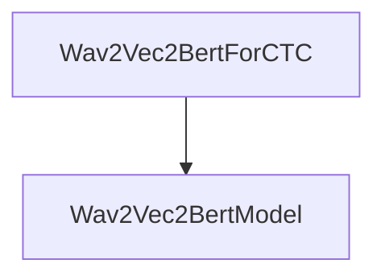

# Speech Recognition Module

The `speech_recognition` module provides functionalities for Automatic Speech Recognition (ASR) using the Wav2Vec2-BERT model architecture, specifically tailored for Connectionist Temporal Classification (CTC) tasks. It serves as a crucial component for converting spoken language into text.

## Purpose and Core Functionality

This module's primary purpose is to enable speech-to-text conversion. It encapsulates the `Wav2Vec2BertForCTC` model, which takes raw audio features as input, processes them through a Wav2Vec2-BERT backbone, and outputs logits for character prediction. The module also handles the calculation of the CTC loss when training with ground truth labels.

Key functionalities include:

- **Speech Feature Processing**: Utilizes the underlying Wav2Vec2-BERT model to extract meaningful features from input audio.
- **Logit Generation**: Produces a sequence of logits, where each logit distribution corresponds to possible characters at each timestep.
- **Connectionist Temporal Classification (CTC)**: Implements the CTC loss mechanism, allowing for end-to-end training of ASR models without requiring explicit alignment between audio and transcriptions.
- **Adapter Support**: Optionally supports language-specific adapters for fine-tuning or multilingual applications.

## Architecture and Component Relationships

The `speech_recognition` module is a leaf module within the `wav2vec2_bert_models` family. Its main component, `Wav2Vec2BertForCTC`, directly interacts with the core `Wav2Vec2BertModel` for feature extraction and sequence processing, then applies a linear layer for final token prediction.

<!-- DIAGRAM_JSON
{
    "direction": "TD",
    "nodes": [
        {"id": "speech_recognition_ctc_model", "label": "Wav2Vec2BertForCTC", "type": "component", "link": null},
        {"id": "wav2vec2_bert_model_core", "label": "Wav2Vec2BertModel", "type": "external", "link": "wav2vec2_bert_models.md"}
    ],
    "edges": [
        {"source": "speech_recognition_ctc_model", "target": "wav2vec2_bert_model_core"}
    ],
    "groups": []
}
-->

## Detailed Component Description

### Wav2Vec2BertForCTC

- **ID**: `src.transformers.models.wav2vec2_bert.modeling_wav2vec2_bert.Wav2Vec2BertForCTC`
- **Purpose**: This class represents a Wav2Vec2-BERT model specifically designed for Connectionist Temporal Classification (CTC). It extends `Wav2Vec2BertPreTrainedModel` and adds a linear layer (`lm_head`) on top of the Wav2Vec2-BERT encoder's output to predict characters for ASR.

- **Initialization (`__init__`)**:
    - Takes `config` (model configuration) and an optional `target_lang` for adapter support.
    - Initializes the `wav2vec2_bert` backbone using `Wav2Vec2BertModel(config)`.
    - Sets up a dropout layer (`config.final_dropout`).
    - Creates a linear `lm_head` that maps the hidden states' dimension to the `config.vocab_size`, representing the vocabulary of predicted tokens.

- **Forward Pass (`forward`)**:
    - **Inputs**:
        - `input_features` (`torch.Tensor`): The input audio features.
        - `attention_mask` (`torch.Tensor`, *optional*): Mask to avoid performing attention on padding token indices.
        - `labels` (`torch.LongTensor`, *optional*): Ground truth labels for CTC loss calculation. Labels set to `-100` are ignored.
    - **Process**:
        1.  Passes `input_features` and `attention_mask` through the `self.wav2vec2_bert` model to obtain contextualized hidden states.
        2.  Applies dropout to the hidden states.
        3.  Feeds the processed hidden states into the `self.lm_head` to generate `logits` over the vocabulary.
        4.  If `labels` are provided, it calculates the CTC loss using `nn.functional.ctc_loss`. This involves:
            - Determining input lengths from the `attention_mask`.
            - Identifying and flattening valid `labels`.
            - Applying `log_softmax` to `logits`.
            - Calling `nn.functional.ctc_loss` with the appropriate parameters, including `blank` token ID and `reduction` strategy.
    - **Outputs**:
        - Returns a `CausalLMOutput` object (if `return_dict` is True) or a tuple containing `loss` (if calculated), `logits`, `hidden_states`, and `attentions`.